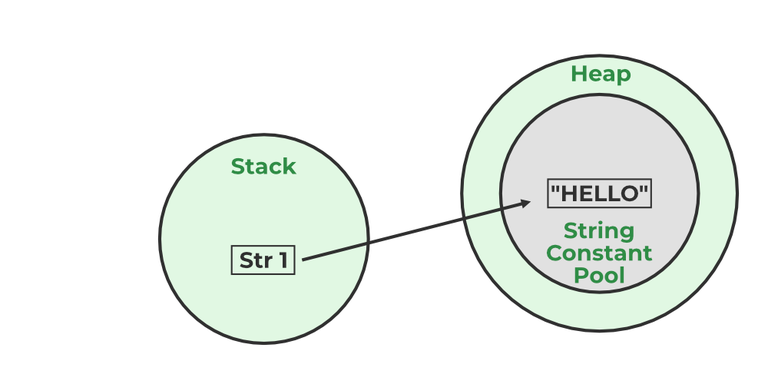

# Core Java Prep

# Table of Contents
- [1. Why is Java platform independent?](#1-why-is-java-platform-independent)
- [2. What are the top features of Java?](#2-what-are-the-top-features-of-java)
- [3. What is JVM?](#3-what-is-jvm)
- [4. What is JIT?](#4-what-is-jit)
- [5. What are memory storages available with JVM?](#5-what-are-memory-storages-available-with-jvm)
- [6. What is ClassLoader?](#6-what-is-classloader)
- [7. What is the difference between JVM, JRE, and JDK?](#7-what-is-the-difference-between-jvm-jre-and-jdk)
- [8. Explain `public static void main(String args[])` in Java](#8-explain-public-static-void-mainstring-args-in-java)
- [9. What is the String Pool in Java?](#9-what-is-the-string-pool-in-java)
- [10. What will happen if we don’t declare the main as static?](#10-what-will-happen-if-we-dont-declare-the-main-as-static)
- [11. What are packages? Why are they used? Advantages and types of packages?](#11-what-are-packages-why-are-they-used-advantages-and-types-of-packages)
- [12. Explain different data types in Java](#12-explain-different-data-types-in-java)
- [13. What is the `byte` datatype in Java? When is it used? What is its default value?](#13-what-is-the-byte-datatype-in-java-when-is-it-used-what-is-its-default-value)
- [14. What is the default value of `float` and `double` datatype in Java?](#14-what-is-the-default-value-of-float-and-double-datatype-in-java)
- [15. What are Wrapper Classes in Java? Why are they used?](#15-what-are-wrapper-classes-in-java-why-are-they-used)
- [16. What are the default values assigned to variables and instances in Java?](#16-what-are-the-default-values-assigned-to-variables-and-instances-in-java)
- [17. What is a Class Variable?](#17-what-is-a-class-variable)
- [18. What is a static variable?](#18-what-is-a-static-variable)
- [19. What is the difference between System.out, System.err, and System.in?](#19-what-is-the-difference-between-systemout-systemerr-and-systemin)
- [20. What is the difference between the Reader/Writer class hierarchy and the InputStream/OutputStream class hierarchy?](#20-what-is-the-difference-between-the-readerwriter-class-hierarchy-and-the-inputstreamoutputstream-class-hierarchy)
- [21. What are the super most classes for all the streams?](#21-what-are-the-super-most-classes-for-all-the-streams)
- [22. What are the FileInputStream and FileOutputStream?](#22-what-are-the-fileinputstream-and-fileoutputstream)
- [23. What is the purpose of using BufferedInputStream and BufferedOutputStream classes?](#23-what-is-the-purpose-of-using-bufferedinputstream-and-bufferedoutputstream-classes)
- [24. What are FilterStreams?](#24-what-are-filterstreams)
- [25. What is an I/O filter?](#25-what-is-an-io-filter)
- [26. What is the difference in the use of `print`, `println`, and `printf`?](#26-what-is-the-difference-in-the-use-of-print-println-and-printf)
- [27. What are operators? How many types of operators are available in Java?](#27-what-are-operators-how-many-types-of-operators-are-available-in-java)
- [28. Explain the difference between `>>` and `>>>` operators](#28-explain-the-difference-between-and-operators)
- [29. Which Java operator is right associative?](#29-which-java-operator-is-right-associative)
- [30. What is the dot operator?](#30-what-is-the-dot-operator)
- [31. What is covariant return type?](#31-what-is-covariant-return-type)
- [32. What is the `transient` keyword?](#32-what-is-the-transient-keyword)
- [33. What are the differences between String and StringBuffer?](#33-what-are-the-differences-between-string-and-stringbuffer)
- [34. What are the differences between StringBuffer and StringBuilder?](#34-what-are-the-differences-between-stringbuffer-and-stringbuilder)
- [35. Which among StringBuilder or StringBuffer should be preferred when there are a lot of updates required to be done in the data?](#35-which-among-stringbuilder-or-stringbuffer-should-be-preferred-when-there-are-a-lot-of-updates-required-to-be-done-in-the-data)
- [36. Why is StringBuffer called mutable?](#36-why-is-stringbuffer-called-mutable)
- [37. How is the creation of a String using `new()` different from that of a literal?](#37-how-is-the-creation-of-a-string-using-new-different-from-that-of-a-literal)
- [38. What is an array in Java?](#38-what-is-an-array-in-java)
- [39. On which memory arrays are created in Java?](#39-on-which-memory-arrays-are-created-in-java)
- [40. What are the types of an array?](#40-what-are-the-types-of-an-array)
- [41. Why does the Java array index start with 0?](#41-why-does-the-java-array-index-start-with-0)
- [42. What is the difference between `int array[]` and `int[] array`?](#42-what-is-the-difference-between-int-array-and-int-array)
- [43. How to copy an array in Java?](#43-how-to-copy-an-array-in-java)
- [44. What do you understand by the jagged array?](#44-what-do-you-understand-by-the-jagged-array)
- [45. Is it possible to make an array volatile?](#45-is-it-possible-to-make-an-array-volatile)
- [46. What are the advantages and disadvantages of an array?](#46-what-are-the-advantages-and-disadvantages-of-an-array)
- [47. What is an object-oriented paradigm?](#47-what-is-an-object-oriented-paradigm)
- [48. What are the main concepts of OOPs in Java?](#48-what-are-the-main-concepts-of-oops-in-java)
- [49. How is the `new` operator different from the `newInstance()` operator in Java?](#49-how-is-the-new-operator-different-from-the-newinstance-operator-in-java)
- [50. What are Classes in Java?](#50-what-are-classes-in-java)
- [51. What is `this` keyword in Java?](#51-what-is-this-keyword-in-java)
- [52. What is the difference between static (class) method and instance method?](#52-what-is-the-difference-between-static-class-method-and-instance-method)
- [53. What are Access Specifiers in Java?](#53-what-are-access-specifiers-in-java)
- [54. What will be the initial value of an object reference which is defined as an instance variable?](#54-what-will-be-the-initial-value-of-an-object-reference-which-is-defined-as-an-instance-variable)
- [55. What is an object?](#55-what-is-an-object)
- [56. What are the different ways to create objects in Java?](#56-what-are-the-different-ways-to-create-objects-in-java)
- [57. What are the advantages and disadvantages of object cloning?](#57-what-are-the-advantages-and-disadvantages-of-object-cloning)
- [58. What are the advantages of passing `this` into a method instead of the current class object itself?](#58-what-are-the-advantages-of-passing-this-into-a-method-instead-of-the-current-class-object-itself)
- [59. What is the constructor?](#59-what-is-the-constructor)
- [60. What happens if you don’t provide a constructor in a class?](#60-what-happens-if-you-dont-provide-a-constructor-in-a-class)
- [61. How many types of constructors are used in Java?](#61-how-many-types-of-constructors-are-used-in-java)
- [62. What is the purpose of a default constructor?](#62-what-is-the-purpose-of-a-default-constructor)
- [63. What do you understand by copy constructor in Java?](#63-what-do-you-understand-by-copy-constructor-in-java)
- [64. Where and how can you use a private constructor?](#64-where-and-how-can-you-use-a-private-constructor)
- [65. What are the differences between the constructors and methods?](#65-what-are-the-differences-between-the-constructors-and-methods)
- [66. What is an Interface? Features of Interface?](#66-what-is-an-interface-features-of-interface)
- [67. What is a marker interface?](#67-what-is-a-marker-interface)
- [68. What do you mean by data encapsulation? Advantages, primary benefit?](#68-what-do-you-mean-by-data-encapsulation-advantages-primary-benefit)
- [69. What do you mean by aggregation?](#69-what-do-you-mean-by-aggregation)
- [70. What is Is-a relationship?](#70-what-is-is-a-relationship)
- [71. Define Inheritance. Types?](#71-define-inheritance-types)
- [72. Although inheritance is a popular OOPs concept, it is less advantageous than composition. Explain.](#72-although-inheritance-is-a-popular-oops-concept-it-is-less-advantageous-than-composition-explain)
- [73. What is association and aggregation?](#73-what-is-association-and-aggregation)
- [74. What is Composition in Java?](#74-what-is-composition-in-java)
- [75. What is the difference between Composition and Aggregation?](#75-what-is-the-difference-between-composition-and-aggregation)

# Q&A

## 1. Why is Java platform independent?

Java is considered platform independent because its code is compiled into an intermediate form called bytecode. This bytecode can be executed on any platform that has a Java Virtual Machine (JVM), which acts as an interpreter between the bytecode and the underlying operating system. This "write once, run anywhere" capability is a key feature of Java.


## 2. What are the top features of Java?

Java has several key features that make it a popular programming language:

1. **Platform Independence**: Java's "write once, run anywhere" capability allows code to run on any device with a JVM.
2. **Object-Oriented**: Java is based on the principles of object-oriented programming, making it modular, flexible, and extensible.
3. **Robust**: Java provides strong memory management, exception handling, and type checking to ensure reliability.
4. **Secure**: Java includes built-in security features like bytecode verification, a security manager, and cryptographic APIs.
5. **Multithreaded**: Java supports multithreading, enabling concurrent execution of two or more threads for better performance.
6. **High Performance**: Java's Just-In-Time (JIT) compiler optimizes bytecode to native machine code for faster execution.
7. **Rich API**: Java provides a comprehensive set of APIs for tasks like networking, I/O, and database access.
8. **Scalability**: Java is suitable for building applications ranging from small-scale to enterprise-level systems.


## 3. What is JVM?

The Java Virtual Machine (JVM) is an integral part of the Java Runtime Environment (JRE) that enables Java applications to run. It performs the following key functions:

1. **Bytecode Execution**: The JVM interprets or compiles Java bytecode into machine code that can be executed by the host system.
2. **Memory Management**: It manages memory allocation and garbage collection to optimize resource usage.
3. **Platform Independence**: By abstracting the underlying hardware and operating system, the JVM ensures that Java applications can run on any platform with a compatible JVM.
4. **Security**: The JVM enforces security policies, such as sandboxing, to protect the system from malicious code.

The JVM is what makes Java's "write once, run anywhere" principle possible.


## 4. What is JIT?

The Just-In-Time (JIT) compiler is a component of the Java Virtual Machine (JVM) that improves the performance of Java applications. It works by compiling bytecode into native machine code at runtime, allowing the program to execute faster. Key features of JIT include:

1. **Dynamic Compilation**: Converts frequently executed bytecode into native code during runtime.
2. **Performance Optimization**: Applies optimizations like inlining and loop unrolling to improve execution speed.
3. **Adaptive Execution**: Focuses on optimizing "hot spots" (frequently executed code paths) for better performance.
4. **Reduced Overhead**: Once compiled, the native code is cached, reducing the need for repeated interpretation.

The JIT compiler is a crucial part of the JVM's ability to deliver high performance for Java applications.


## 5. What are memory storages available with JVM?

The JVM divides memory into different regions to efficiently manage the execution of Java applications. These memory storages include:

1. **Heap**: Used for dynamic memory allocation. Objects and class instances are stored here. It is divided into:
    - **Young Generation**: Stores short-lived objects.
    - **Old Generation**: Stores long-lived objects.
    - **Permanent Generation (or Metaspace)**: Stores metadata about classes (Metaspace is used in Java 8 and later).

2. **Stack**: Stores method call frames, including local variables, method arguments, and return values. Each thread has its own stack.

3. **Method Area**: Stores class-level data such as runtime constant pool, method code, and field information. It is shared among all threads.

4. **Program Counter (PC) Register**: A small memory area that holds the address of the currently executing JVM instruction for each thread.

5. **Native Method Stack**: Used for executing native (non-Java) methods. Each thread has its own native method stack.

These memory areas work together to ensure efficient execution and memory management in Java applications.


## 6. What is ClassLoader?

The ClassLoader in Java is a part of the Java Runtime Environment (JRE) responsible for dynamically loading Java classes into the Java Virtual Machine (JVM). It is a subsystem of the JVM that loads, links, and initializes classes during runtime. Key points about ClassLoader include:

1. **Delegation Model**: Class loading follows a parent-delegation model where a ClassLoader delegates the loading request to its parent before attempting to load the class itself.
2. **Types of ClassLoaders**:
    - **Bootstrap ClassLoader**: Loads core Java classes from the `rt.jar` file or the Java runtime environment.
    - **Extension ClassLoader**: Loads classes from the `ext` directory or specified extension paths.
    - **Application ClassLoader**: Loads classes from the application's classpath.
3. **Custom ClassLoaders**: Developers can create custom ClassLoaders to load classes in specific ways, such as from a network or encrypted files.
4. **Dynamic Loading**: Enables loading classes at runtime, which is useful for frameworks and applications requiring modularity or plugins.

The ClassLoader plays a crucial role in Java's ability to support dynamic and flexible application architectures.


## 7. What is the difference between JVM, JRE, and JDK?

Java has three key components that work together to enable development and execution of Java applications:

1. **JVM (Java Virtual Machine)**:
    - The JVM is a runtime environment that executes Java bytecode.
    - It provides platform independence by abstracting the underlying hardware and operating system.
    - Key responsibilities include bytecode interpretation, memory management, and security enforcement.

2. **JRE (Java Runtime Environment)**:
    - The JRE is a software package that provides the libraries and JVM required to run Java applications.
    - It includes the JVM, core libraries, and other components necessary for executing Java programs.
    - The JRE does not include development tools like compilers or debuggers.

3. **JDK (Java Development Kit)**:
    - The JDK is a complete development environment for building Java applications.
    - It includes the JRE, as well as development tools like the Java compiler (`javac`), debugger, and other utilities.
    - The JDK is required for writing, compiling, and debugging Java programs.

### Summary Table:

| Component | Purpose                          | Includes                     |
|-----------|----------------------------------|------------------------------|
| JVM       | Executes Java bytecode          | Part of JRE                  |
| JRE       | Runs Java applications          | JVM + Core Libraries         |
| JDK       | Develops Java applications      | JRE + Development Tools      |


## 8. Explain `public static void main(String args[])` in Java

The `public static void main(String args[])` method is the entry point of any Java application. Each part of the method signature has a specific purpose:

1. **`public`**: The method is public so that it can be accessed by the JVM from outside the class.
2. **`static`**: The method is static so that it can be called without creating an instance of the class. This is necessary because the JVM needs to invoke the method without instantiating the class.
3. **`void`**: The method does not return any value.
4. **`main`**: This is the name of the method that the JVM looks for as the starting point of the program.
5. **`String args[]`**: This is an array of `String` objects that stores command-line arguments passed to the program. For example, if the program is run as `java MyClass arg1 arg2`, the `args` array will contain `["arg1", "arg2"]`.

### Example:

```java
public class Main {
    public static void main(String args[]) {
        System.out.println("Hello, World!");
    }
}
```

In this example, the `main` method is executed by the JVM, and it prints "Hello, World!" to the console.


## 9. What is the String Pool in Java?

The String Pool in Java is a special memory area within the heap where `String` literals are stored. It is part of the Java String Interning mechanism, which helps optimize memory usage and improve performance. Key points about the String Pool include:

1. **String Interning**: When a `String` literal is created, the JVM checks the String Pool to see if an identical `String` already exists. If it does, the reference to the existing `String` is returned instead of creating a new object.
2. **Immutability**: Since `String` objects are immutable in Java, sharing the same `String` instance across multiple references is safe and avoids duplication.
3. **Creation of Strings**:
    - **Literals**: Strings created using double quotes (e.g., `"hello"`) are automatically added to the String Pool.
    - **`new` Keyword**: Strings created using the `new` keyword (e.g., `new String("hello")`) are stored in the heap, not the String Pool, unless explicitly interned using the `intern()` method.
4. **Performance Benefits**: The String Pool reduces memory usage and improves performance by reusing `String` objects instead of creating duplicates.

### Example:

```java
public class StringPoolExample {
    public static void main(String[] args) {
        String s1 = "hello";
        String s2 = "hello";
        String s3 = new String("hello");

        System.out.println(s1 == s2); // true, both refer to the same object in the String Pool
        System.out.println(s1 == s3); // false, s3 refers to a different object in the heap

        String s4 = s3.intern(); // Adds s3 to the String Pool if not already present
        System.out.println(s1 == s4); // true, both now refer to the same object in the String Pool
    }
}
```

In this example, `s1` and `s2` share the same reference from the String Pool, while `s3` is a separate object in the heap until it is interned.




## 10. What will happen if we don’t declare the main as static?

If the `main` method is not declared as `static`, the Java Virtual Machine (JVM) will not be able to invoke it directly when starting the program. This will result in a runtime error. The reason for this is that the JVM needs to call the `main` method without creating an instance of the class, and a non-static method requires an instance to be invoked.

### Example:

```java
public class Main {
    public void main(String[] args) {
        System.out.println("This will not work!");
    }
}
```

### Output:

```
Error: Main method is not static in class Main, please define the main method as:
   public static void main(String[] args)
```

To fix this issue, the `main` method must be declared as `static` so that the JVM can call it without needing an object of the class.


## 11. What are packages? Why are they used? Advantages and types of packages?

In Java, a package is a namespace that organizes classes and interfaces. It is used to group related classes and interfaces together, making it easier to manage and avoid naming conflicts. Packages are similar to directories in a file system.

### Why are packages used?

1. **Organizing Code**: Packages help organize classes and interfaces into logical groups, making the codebase easier to navigate and maintain.
2. **Avoiding Name Conflicts**: By grouping classes into packages, developers can avoid naming conflicts between classes with the same name in different packages.
3. **Access Control**: Packages provide a way to control access to classes and members using access modifiers like `public`, `protected`, and `default`.
4. **Reusability**: Classes in a package can be reused across multiple projects, promoting code reusability.

### Advantages of Packages

1. **Modularity**: Packages make the code modular and easier to manage.
2. **Encapsulation**: They allow better encapsulation by restricting access to certain classes or members.
3. **Code Reusability**: Classes in a package can be reused in other programs.
4. **Improved Maintainability**: Grouping related classes together improves maintainability and readability.
5. **Predefined Libraries**: Java provides a rich set of predefined packages (e.g., `java.util`, `java.io`) that developers can use.

### Types of Packages

1. **Built-in Packages**: These are predefined packages provided by Java, such as:
    - `java.lang`: Contains fundamental classes like `String`, `Math`, and `Object`.
    - `java.util`: Provides utility classes like `ArrayList`, `HashMap`, and `Collections`.
    - `java.io`: Includes classes for input and output operations.
    - `java.net`: Contains classes for networking.
    - `java.sql`: Provides classes for database connectivity.

2. **User-defined Packages**: These are custom packages created by developers to organize their own classes and interfaces.

### Example of Creating and Using a Package

#### Creating a Package:

```java
// File: MyPackage/MyClass.java
package MyPackage;

public class MyClass {
     public void displayMessage() {
          System.out.println("Hello from MyPackage!");
     }
}
```

#### Using the Package:

```java
// File: Main.java
import MyPackage.MyClass;

public class Main {
     public static void main(String[] args) {
          MyClass obj = new MyClass();
          obj.displayMessage();
     }
}
```

### Output:

```
Hello from MyPackage!
```

In this example, the `MyClass` is part of the `MyPackage` package, and it is imported and used in the `Main` class.


## 12. Explain different data types in Java

Java provides a rich set of data types to handle different kinds of data. These data types are broadly categorized into two types: **Primitive Data Types** and **Non-Primitive Data Types**.

### 1. Primitive Data Types

Primitive data types are the most basic data types in Java. They are predefined by the language and serve as the building blocks for data manipulation. There are 8 primitive data types:

| Data Type | Size    | Default Value | Description                                                                 |
|-----------|---------|---------------|-----------------------------------------------------------------------------|
| `byte`    | 1 byte  | `0`           | Stores whole numbers from -128 to 127. Useful for saving memory in large arrays. |
| `short`   | 2 bytes | `0`           | Stores whole numbers from -32,768 to 32,767.                                |
| `int`     | 4 bytes | `0`           | Stores whole numbers from -2^31 to 2^31-1.                                  |
| `long`    | 8 bytes | `0L`          | Stores whole numbers from -2^63 to 2^63-1. Use `L` suffix for literals.     |
| `float`   | 4 bytes | `0.0f`        | Stores fractional numbers up to 7 decimal digits. Use `f` suffix for literals. |
| `double`  | 8 bytes | `0.0d`        | Stores fractional numbers up to 15 decimal digits. Use `d` suffix for literals. |
| `char`    | 2 bytes | `'\u0000'`    | Stores a single 16-bit Unicode character.                                   |
| `boolean` | 1 bit   | `false`       | Stores `true` or `false`.                                                   |

### Example:

```java
public class DataTypesExample {
    public static void main(String[] args) {
        int age = 25;
        double salary = 50000.75;
        char grade = 'A';
        boolean isEmployed = true;

        System.out.println("Age: " + age);
        System.out.println("Salary: " + salary);
        System.out.println("Grade: " + grade);
        System.out.println("Employed: " + isEmployed);
    }
}
```

### Output:

```
Age: 25
Salary: 50000.75
Grade: A
Employed: true
```

### 2. Non-Primitive Data Types

Non-primitive data types (also called reference types) are more complex and include classes, interfaces, arrays, and strings. These types are not predefined and are created by the programmer.

#### Examples of Non-Primitive Data Types:

1. **String**: Represents a sequence of characters.
   ```java
   String name = "John";
   System.out.println("Name: " + name);
   ```

2. **Array**: Stores multiple values of the same type.
   ```java
   int[] numbers = {1, 2, 3, 4, 5};
   System.out.println("First number: " + numbers[0]);
   ```

3. **Class**: Represents user-defined data types.
   ```java
   class Person {
       String name;
       int age;
   }
   ```

4. **Interface**: Represents a contract for classes to implement.

### Key Differences Between Primitive and Non-Primitive Data Types

| Feature                | Primitive Data Types         | Non-Primitive Data Types         |
|------------------------|------------------------------|-----------------------------------|
| **Predefined**         | Yes                         | No (except `String`)             |
| **Memory Allocation**  | Stored in stack             | Stored in heap                   |
| **Default Values**     | Have default values         | Default value is `null`          |
| **Operations**         | Operated directly           | Operated via references          |

Understanding these data types is essential for writing efficient and error-free Java programs.


## 13. What is the `byte` datatype in Java? When is it used? What is its default value?

The `byte` datatype in Java is one of the eight primitive data types. It is used to store small integer values and is particularly useful in scenarios where memory optimization is critical.

### Key Features of `byte`:

1. **Size**: The `byte` datatype is 1 byte (8 bits) in size.
2. **Range**: It can store values from `-128` to `127`.
3. **Default Value**: The default value of a `byte` variable is `0`.

### When is `byte` used?

1. **Memory Optimization**: The `byte` datatype is ideal for saving memory in large arrays where the values fall within the range of `-128` to `127`.
2. **Data Streams**: It is commonly used in I/O operations, such as reading and writing binary data from files or network streams.
3. **Low-Level Programming**: The `byte` datatype is useful in low-level programming tasks, such as working with raw data or communication protocols.

### Example:

```java
public class ByteExample {
    public static void main(String[] args) {
        byte smallNumber = 100;
        byte defaultValue = 0; // Default value of byte

        System.out.println("Small Number: " + smallNumber);
        System.out.println("Default Value: " + defaultValue);
    }
}
```

### Output:

```
Small Number: 100
Default Value: 0
```

In this example, the `byte` datatype is used to store a small integer value, demonstrating its memory-efficient nature.


## 14. What is the default value of `float` and `double` datatype in Java?

In Java, the `float` and `double` datatypes are used to store fractional numbers. Each has a specific default value:

1. **`float`**:
    - Default Value: `0.0f`
    - Size: 4 bytes
    - Precision: Up to 7 decimal digits

2. **`double`**:
    - Default Value: `0.0d`
    - Size: 8 bytes
    - Precision: Up to 15 decimal digits

### Example:

```java
public class DefaultValuesExample {
     static float defaultFloat;
     static double defaultDouble;

     public static void main(String[] args) {
          System.out.println("Default float value: " + defaultFloat);
          System.out.println("Default double value: " + defaultDouble);
     }
}
```

### Output:

```
Default float value: 0.0
Default double value: 0.0
```

In this example, the default values of `float` and `double` are demonstrated when they are declared as static variables.


## 15. What are Wrapper Classes in Java? Why are they used?

Wrapper classes in Java are used to convert primitive data types into objects. Each primitive type has a corresponding wrapper class in the `java.lang` package. For example, `int` has `Integer`, `double` has `Double`, and so on.

### Why are Wrapper Classes Used?

1. **Object-Oriented Features**: Java is an object-oriented language, and wrapper classes allow primitives to be treated as objects.
2. **Collections Framework**: Collections like `ArrayList` and `HashMap` can only store objects, not primitives. Wrapper classes enable storing primitive values in collections.
3. **Utility Methods**: Wrapper classes provide utility methods for parsing, converting, and manipulating data. For example, `Integer.parseInt()` converts a `String` to an `int`.
4. **Autoboxing and Unboxing**: Wrapper classes enable autoboxing (automatic conversion of primitives to objects) and unboxing (automatic conversion of objects to primitives), simplifying code.
5. **Null Values**: Wrapper classes can represent `null`, which is not possible with primitive types.

### Example:

```java
public class WrapperExample {
    public static void main(String[] args) {
        // Autoboxing: Converting primitive to wrapper object
        int primitiveInt = 10;
        Integer wrapperInt = primitiveInt;

        // Unboxing: Converting wrapper object to primitive
        int unboxedInt = wrapperInt;

        // Using utility methods
        String numberStr = "123";
        int parsedInt = Integer.parseInt(numberStr);

        System.out.println("Wrapper Object: " + wrapperInt);
        System.out.println("Unboxed Primitive: " + unboxedInt);
        System.out.println("Parsed Integer: " + parsedInt);
    }
}
```

### Output:

```
Wrapper Object: 10
Unboxed Primitive: 10
Parsed Integer: 123
```

### List of Wrapper Classes:

| Primitive Type | Wrapper Class |
|----------------|---------------|
| `byte`         | `Byte`        |
| `short`        | `Short`       |
| `int`          | `Integer`     |
| `long`         | `Long`        |
| `float`        | `Float`       |
| `double`       | `Double`      |
| `char`         | `Character`   |
| `boolean`      | `Boolean`     |

Wrapper classes bridge the gap between primitive types and objects, making them essential for modern Java programming.


## 16. What are the default values assigned to variables and instances in Java?

In Java, when variables or instance fields are declared but not explicitly initialized, they are assigned default values based on their data type. These default values ensure that uninitialized variables have a predictable state.

### Default Values for Primitive Data Types:

| Data Type   | Default Value |
|-------------|---------------|
| `byte`      | `0`           |
| `short`     | `0`           |
| `int`       | `0`           |
| `long`      | `0L`          |
| `float`     | `0.0f`        |
| `double`    | `0.0d`        |
| `char`      | `'\u0000'` (null character) |
| `boolean`   | `false`       |

### Default Values for Non-Primitive Data Types:

| Data Type       | Default Value |
|------------------|---------------|
| `String`         | `null`        |
| Arrays           | `null`        |
| Objects          | `null`        |

### Example:

```java
public class DefaultValuesExample {
    byte byteVar;
    int intVar;
    float floatVar;
    boolean boolVar;
    String strVar;

    public static void main(String[] args) {
        DefaultValuesExample example = new DefaultValuesExample();
        System.out.println("Default byte: " + example.byteVar);
        System.out.println("Default int: " + example.intVar);
        System.out.println("Default float: " + example.floatVar);
        System.out.println("Default boolean: " + example.boolVar);
        System.out.println("Default String: " + example.strVar);
    }
}
```

### Output:

```
Default byte: 0
Default int: 0
Default float: 0.0
Default boolean: false
Default String: null
```

### Notes:

1. **Local Variables**: Local variables inside methods do not have default values and must be explicitly initialized before use. Attempting to use an uninitialized local variable will result in a compilation error.
2. **Static Fields**: Static fields of a class are also assigned default values if not explicitly initialized.

Default values provide a safety net for uninitialized fields, ensuring that they have a defined state when accessed. 


## 17. What is a Class Variable?

A class variable, also known as a static variable, is a variable that is declared with the `static` keyword in a class. It is shared among all instances of the class, meaning that there is only one copy of the variable in memory, regardless of how many objects of the class are created.

### Key Features of Class Variables:

1. **Shared Across Instances**: All instances of the class share the same class variable. Changes made to the variable by one instance are reflected in all other instances.
2. **Memory Allocation**: Class variables are stored in the method area of the JVM and are loaded when the class is loaded into memory.
3. **Access**: Class variables can be accessed using the class name (e.g., `ClassName.variableName`) or through an instance of the class.
4. **Lifetime**: The lifetime of a class variable is tied to the lifetime of the class in which it is declared.

### Example:

```java
public class Example {
    static int count = 0; // Class variable

    public Example() {
        count++;
    }

    public static void main(String[] args) {
        Example obj1 = new Example();
        Example obj2 = new Example();
        Example obj3 = new Example();

        System.out.println("Number of objects created: " + Example.count);
    }
}
```

### Output:

```
Number of objects created: 3
```

### Use Cases:

1. **Counters**: Class variables are often used to keep track of counts, such as the number of objects created.
2. **Constants**: Class variables can be used to define constants that are shared across all instances (e.g., `static final` variables).
3. **Shared Resources**: They can represent shared resources, such as a database connection pool or configuration settings.

Class variables are an essential feature of Java, enabling shared state and behavior across all instances of a class.

## 18. What is a static variable?

A static variable in Java is a class-level variable that is declared using the `static` keyword. It is shared among all instances of the class, meaning there is only one copy of the variable in memory, regardless of how many objects of the class are created.

### Key Features of Static Variables:

1. **Shared Across Instances**: All instances of the class share the same static variable. Changes made to the variable by one instance are reflected in all other instances.
2. **Memory Allocation**: Static variables are stored in the method area of the JVM and are loaded when the class is loaded into memory.
3. **Access**: Static variables can be accessed using the class name (e.g., `ClassName.variableName`) or through an instance of the class.
4. **Lifetime**: The lifetime of a static variable is tied to the lifetime of the class in which it is declared.

### Example:

```java
public class Example {
    static int count = 0; // Static variable

    public Example() {
        count++;
    }

    public static void main(String[] args) {
        Example obj1 = new Example();
        Example obj2 = new Example();
        Example obj3 = new Example();

        System.out.println("Number of objects created: " + Example.count);
    }
}
```

### Output:

```
Number of objects created: 3
```

### Use Cases:

1. **Counters**: Static variables are often used to keep track of counts, such as the number of objects created.
2. **Constants**: Static variables can be used to define constants that are shared across all instances (e.g., `static final` variables).
3. **Shared Resources**: They can represent shared resources, such as a database connection pool or configuration settings.

Static variables are an essential feature of Java, enabling shared state and behavior across all instances of a class.


## 19. What is the difference between System.out, System.err, and System.in?

In Java, `System.out`, `System.err`, and `System.in` are standard streams provided by the `java.lang.System` class for input and output operations. Each serves a specific purpose:

1. **`System.out`**:
    - Represents the standard output stream.
    - Used to print normal messages or output to the console.
    - Typically writes to the console or terminal.
    - Example:
      ```java
      System.out.println("This is standard output.");
      ```

2. **`System.err`**:
    - Represents the standard error stream.
    - Used to print error messages or diagnostics to the console.
    - By default, it writes to the same location as `System.out`, but it can be redirected separately.
    - Example:
      ```java
      System.err.println("This is an error message.");
      ```

3. **`System.in`**:
    - Represents the standard input stream.
    - Used to read input from the user, typically from the keyboard.
    - Often used with classes like `Scanner` or `BufferedReader` to process input.
    - Example:
      ```java
      import java.util.Scanner;

      public class InputExample {
          public static void main(String[] args) {
              Scanner scanner = new Scanner(System.in);
              System.out.print("Enter your name: ");
              String name = scanner.nextLine();
              System.out.println("Hello, " + name + "!");
          }
      }
      ```

### Key Differences:

| Stream       | Purpose                     | Default Destination/Source |
|--------------|-----------------------------|----------------------------|
| `System.out` | Standard output stream      | Console/Terminal           |
| `System.err` | Standard error stream       | Console/Terminal           |
| `System.in`  | Standard input stream       | Keyboard                   |

These streams provide a simple way to handle input and output in Java applications.


## 20. What is the difference between the Reader/Writer class hierarchy and the InputStream/OutputStream class hierarchy?

In Java, the `Reader/Writer` and `InputStream/OutputStream` class hierarchies are used for handling I/O operations, but they are designed for different types of data.

### Key Differences:

| Feature                     | Reader/Writer Hierarchy                     | InputStream/OutputStream Hierarchy          |
|-----------------------------|---------------------------------------------|---------------------------------------------|
| **Purpose**                 | Handles character-based data (text).       | Handles byte-based data (binary).          |
| **Data Unit**               | Works with `char` and `String`.            | Works with `byte` and `byte[]`.            |
| **Encoding/Decoding**       | Supports character encoding (e.g., UTF-8). | Does not handle character encoding.        |
| **Use Case**                | Reading/writing text files or streams.     | Reading/writing binary files or streams.   |
| **Examples**                | `FileReader`, `BufferedWriter`.            | `FileInputStream`, `BufferedOutputStream`. |

### Reader/Writer Hierarchy:

- Designed for character streams.
- Automatically handles character encoding and decoding.
- Common classes:
    - `Reader` (abstract class): Base for reading character streams.
    - `Writer` (abstract class): Base for writing character streams.
    - Examples: `FileReader`, `FileWriter`, `BufferedReader`, `BufferedWriter`.

### InputStream/OutputStream Hierarchy:

- Designed for byte streams.
- Does not handle character encoding; works with raw binary data.
- Common classes:
    - `InputStream` (abstract class): Base for reading byte streams.
    - `OutputStream` (abstract class): Base for writing byte streams.
    - Examples: `FileInputStream`, `FileOutputStream`, `BufferedInputStream`, `BufferedOutputStream`.

### Example:

#### Using Reader/Writer:

```java
import java.io.*;

public class ReaderWriterExample {
        public static void main(String[] args) throws IOException {
                FileWriter writer = new FileWriter("example.txt");
                writer.write("Hello, World!");
                writer.close();

                FileReader reader = new FileReader("example.txt");
                int data;
                while ((data = reader.read()) != -1) {
                        System.out.print((char) data);
                }
                reader.close();
        }
}
```

#### Using InputStream/OutputStream:

```java
import java.io.*;

public class InputStreamOutputStreamExample {
        public static void main(String[] args) throws IOException {
                FileOutputStream outputStream = new FileOutputStream("example.bin");
                outputStream.write(new byte[]{65, 66, 67}); // Writes binary data
                outputStream.close();

                FileInputStream inputStream = new FileInputStream("example.bin");
                int data;
                while ((data = inputStream.read()) != -1) {
                        System.out.print((char) data); // Converts binary data to characters
                }
                inputStream.close();
        }
}
```

### Summary:

- Use `Reader/Writer` for text-based data where character encoding is important.
- Use `InputStream/OutputStream` for binary data like images, videos, or raw files.


## 21. What are the super most classes for all the streams?

In Java, the stream classes for handling input and output operations are organized into two main hierarchies: **byte streams** and **character streams**. Each hierarchy has a top-level abstract class that serves as the super most class.

### 1. Byte Streams

- **Super Most Classes**:
    - `InputStream`: The abstract superclass for all classes representing an input stream of bytes.
    - `OutputStream`: The abstract superclass for all classes representing an output stream of bytes.

- **Purpose**: These classes are used for reading and writing raw binary data.

- **Examples**:
    - `FileInputStream`, `BufferedInputStream`, `DataInputStream` (subclasses of `InputStream`).
    - `FileOutputStream`, `BufferedOutputStream`, `DataOutputStream` (subclasses of `OutputStream`).

### 2. Character Streams

- **Super Most Classes**:
    - `Reader`: The abstract superclass for all classes representing a character stream for reading.
    - `Writer`: The abstract superclass for all classes representing a character stream for writing.

- **Purpose**: These classes are used for reading and writing text data, with support for character encoding.

- **Examples**:
    - `FileReader`, `BufferedReader`, `InputStreamReader` (subclasses of `Reader`).
    - `FileWriter`, `BufferedWriter`, `OutputStreamWriter` (subclasses of `Writer`).

### Summary Table:

| Stream Type      | Super Most Class | Purpose                     |
|------------------|------------------|-----------------------------|
| Byte Input       | `InputStream`    | Reading raw binary data     |
| Byte Output      | `OutputStream`   | Writing raw binary data     |
| Character Input  | `Reader`         | Reading text data           |
| Character Output | `Writer`         | Writing text data           |

These super most classes provide the foundation for Java's I/O framework, enabling developers to work with a wide variety of data sources and destinations.


## 22. What are the FileInputStream and FileOutputStream?

`FileInputStream` and `FileOutputStream` are classes in Java's `java.io` package used for reading and writing raw binary data to and from files. They are part of the byte stream hierarchy and are designed to handle binary data like images, audio, and video files.

### 1. **FileInputStream**

- **Purpose**: Reads raw bytes from a file.
- **Key Methods**:
    - `int read()`: Reads a single byte of data.
    - `int read(byte[] b)`: Reads bytes into an array.
    - `void close()`: Closes the stream and releases resources.
- **Example**:

```java
import java.io.FileInputStream;
import java.io.IOException;

public class FileInputStreamExample {
        public static void main(String[] args) {
                try (FileInputStream fis = new FileInputStream("example.txt")) {
                        int data;
                        while ((data = fis.read()) != -1) {
                                System.out.print((char) data); // Converts byte to char for display
                        }
                } catch (IOException e) {
                        e.printStackTrace();
                }
        }
}
```

### 2. **FileOutputStream**

- **Purpose**: Writes raw bytes to a file.
- **Key Methods**:
    - `void write(int b)`: Writes a single byte.
    - `void write(byte[] b)`: Writes an array of bytes.
    - `void close()`: Closes the stream and releases resources.
- **Example**:

```java
import java.io.FileOutputStream;
import java.io.IOException;

public class FileOutputStreamExample {
        public static void main(String[] args) {
                try (FileOutputStream fos = new FileOutputStream("example.txt")) {
                        String content = "Hello, FileOutputStream!";
                        fos.write(content.getBytes()); // Converts string to bytes
                } catch (IOException e) {
                        e.printStackTrace();
                }
        }
}
```

### Key Points:

1. **Binary Data**: Both classes work with raw binary data, making them suitable for non-text files.
2. **Performance**: For better performance, they can be wrapped with buffered streams like `BufferedInputStream` and `BufferedOutputStream`.
3. **Resource Management**: Always close streams using `close()` or try-with-resources to avoid resource leaks.

These classes are fundamental for low-level file I/O operations in Java.


## 23. What is the purpose of using BufferedInputStream and BufferedOutputStream classes?

The `BufferedInputStream` and `BufferedOutputStream` classes in Java are used to improve the performance of input and output operations by adding a buffer to the underlying input and output streams. They are part of the `java.io` package and are designed to reduce the number of I/O operations by reading or writing larger chunks of data at once.

### 1. **BufferedInputStream**

- **Purpose**: Reads data from an input stream into an internal buffer, reducing the number of read operations.
- **Key Features**:
    - Improves performance by minimizing direct disk or network access.
    - Allows marking and resetting the stream for re-reading data.
- **Example**:

```java
import java.io.BufferedInputStream;
import java.io.FileInputStream;
import java.io.IOException;

public class BufferedInputStreamExample {
    public static void main(String[] args) {
        try (BufferedInputStream bis = new BufferedInputStream(new FileInputStream("example.txt"))) {
            int data;
            while ((data = bis.read()) != -1) {
                System.out.print((char) data);
            }
        } catch (IOException e) {
            e.printStackTrace();
        }
    }
}
```

### 2. **BufferedOutputStream**

- **Purpose**: Writes data to an internal buffer before flushing it to the output stream, reducing the number of write operations.
- **Key Features**:
    - Improves performance by batching write operations.
    - Ensures efficient use of system resources.
- **Example**:

```java
import java.io.BufferedOutputStream;
import java.io.FileOutputStream;
import java.io.IOException;

public class BufferedOutputStreamExample {
    public static void main(String[] args) {
        try (BufferedOutputStream bos = new BufferedOutputStream(new FileOutputStream("example.txt"))) {
            String content = "Hello, BufferedOutputStream!";
            bos.write(content.getBytes());
        } catch (IOException e) {
            e.printStackTrace();
        }
    }
}
```

### Key Benefits:

1. **Performance**: Reduces the number of I/O operations by using a buffer.
2. **Efficiency**: Optimizes reading and writing of data, especially for large files or streams.
3. **Flexibility**: Can be combined with other streams like `FileInputStream` and `FileOutputStream`.

The `BufferedInputStream` and `BufferedOutputStream` classes are essential for efficient I/O operations in Java, particularly when working with large files or slow data sources.


## 24. What are FilterStreams?

FilterStreams in Java are part of the `java.io` package and are used to modify or filter data as it is read from or written to a stream. They act as wrappers around existing streams, providing additional functionality without altering the underlying stream's behavior.

### Key Features of FilterStreams:

1. **Chaining**: FilterStreams are designed to be chained with other streams to add functionality, such as buffering, compression, or encryption.
2. **Abstraction**: They are abstract classes (`FilterInputStream` and `FilterOutputStream`) that can be extended to create custom filters.
3. **Flexibility**: Allow developers to process data in a modular and reusable way.

### Types of FilterStreams:

1. **FilterInputStream**:
    - Extends `InputStream`.
    - Examples: `BufferedInputStream`, `DataInputStream`, `PushbackInputStream`.

2. **FilterOutputStream**:
    - Extends `OutputStream`.
    - Examples: `BufferedOutputStream`, `DataOutputStream`, `PrintStream`.

### Example of Using FilterStreams:

#### Using `BufferedInputStream` (a subclass of `FilterInputStream`):

```java
import java.io.*;

public class FilterInputStreamExample {
    public static void main(String[] args) {
        try (BufferedInputStream bis = new BufferedInputStream(new FileInputStream("example.txt"))) {
            int data;
            while ((data = bis.read()) != -1) {
                System.out.print((char) data);
            }
        } catch (IOException e) {
            e.printStackTrace();
        }
    }
}
```

#### Using `DataOutputStream` (a subclass of `FilterOutputStream`):

```java
import java.io.*;

public class FilterOutputStreamExample {
    public static void main(String[] args) {
        try (DataOutputStream dos = new DataOutputStream(new FileOutputStream("example.dat"))) {
            dos.writeInt(42);
            dos.writeDouble(3.14);
        } catch (IOException e) {
            e.printStackTrace();
        }
    }
}
```

### Benefits of FilterStreams:

1. **Modularity**: Add functionality to streams without modifying their core behavior.
2. **Reusability**: Can be reused across different parts of the application.
3. **Extensibility**: Developers can create custom FilterStreams by extending `FilterInputStream` or `FilterOutputStream`.

FilterStreams are a powerful feature in Java's I/O framework, enabling developers to process data streams in a flexible and efficient manner.

25. What is an I/O filter?

An I/O filter in Java is a mechanism used to process data as it is read from or written to a stream. Filters are implemented using the `FilterInputStream` and `FilterOutputStream` classes, which act as wrappers around existing streams to provide additional functionality, such as data transformation, compression, encryption, or buffering.

### Key Features of I/O Filters:

1. **Stream Wrapping**: Filters wrap around other streams to modify or enhance their behavior without altering the underlying stream.
2. **Chaining**: Multiple filters can be chained together to apply a series of transformations or operations on the data.
3. **Reusability**: Filters are modular and can be reused across different parts of an application.

### Common Examples of I/O Filters:

1. **Buffered Streams**:
    - `BufferedInputStream` and `BufferedOutputStream` add buffering to improve performance by reducing the number of I/O operations.

2. **Data Streams**:
    - `DataInputStream` and `DataOutputStream` allow reading and writing of primitive data types in a machine-independent way.

3. **Pushback Streams**:
    - `PushbackInputStream` allows unread bytes to be pushed back into the stream for reprocessing.

4. **Print Streams**:
    - `PrintStream` provides methods for printing formatted data to an output stream.

### Example:

#### Using a Buffered Filter:

```java
import java.io.*;

public class IOFilterExample {
     public static void main(String[] args) {
          try (BufferedInputStream bis = new BufferedInputStream(new FileInputStream("example.txt"))) {
                int data;
                while ((data = bis.read()) != -1) {
                     System.out.print((char) data);
                }
          } catch (IOException e) {
                e.printStackTrace();
          }
     }
}
```

### Benefits of I/O Filters:

1. **Modularity**: Filters allow functionality to be added to streams in a modular way.
2. **Efficiency**: Filters like buffering improve performance by optimizing I/O operations.
3. **Flexibility**: Filters can be combined to create complex data processing pipelines.

I/O filters are a powerful feature of Java's I/O framework, enabling developers to process data streams in a flexible and efficient manner.


## 26. What is the difference in the use of `print`, `println`, and `printf`?

In Java, `print`, `println`, and `printf` are methods of the `PrintStream` class (commonly used via `System.out`) that are used to display output on the console. Each method has a specific purpose and behavior:

### 1. `print`

- **Purpose**: Outputs the given data to the console without appending a newline at the end.
- **Use Case**: When you want to print multiple items on the same line.
- **Example**:

```java
System.out.print("Hello");
System.out.print(" World!");
```

**Output**:
```
Hello World!
```

---

### 2. `println`

- **Purpose**: Outputs the given data to the console and appends a newline at the end.
- **Use Case**: When you want to print each item on a new line.
- **Example**:

```java
System.out.println("Hello");
System.out.println("World!");
```

**Output**:
```
Hello
World!
```

---

### 3. `printf`

- **Purpose**: Outputs formatted data to the console using a format string and arguments.
- **Use Case**: When you need to format the output (e.g., aligning text, controlling decimal places).
- **Example**:

```java
System.out.printf("Hello, %s! You have %d new messages.%n", "Alice", 5);
```

**Output**:
```
Hello, Alice! You have 5 new messages.
```

---

### Key Differences:

| Method   | Appends Newline? | Supports Formatting? | Use Case                          |
|----------|------------------|----------------------|-----------------------------------|
| `print`  | No               | No                   | Print data without a newline.    |
| `println`| Yes              | No                   | Print data with a newline.       |
| `printf` | No (unless `%n`) | Yes                  | Print formatted data.            |

These methods provide flexibility for displaying output in Java, depending on the desired format and structure.


## 27. What are operators? How many types of operators are available in Java?

Operators in Java are special symbols or keywords used to perform operations on variables and values. They are the building blocks of any programming language and are used to manipulate data and variables.

### Types of Operators in Java

Java provides a rich set of operators, which can be categorized into the following types:

1. **Arithmetic Operators**:
    - Used to perform basic arithmetic operations.
    - Examples: `+` (addition), `-` (subtraction), `*` (multiplication), `/` (division), `%` (modulus).

2. **Relational (Comparison) Operators**:
    - Used to compare two values.
    - Examples: `==` (equal to), `!=` (not equal to), `>` (greater than), `<` (less than), `>=` (greater than or equal to), `<=` (less than or equal to).

3. **Logical Operators**:
    - Used to perform logical operations.
    - Examples: `&&` (logical AND), `||` (logical OR), `!` (logical NOT).

4. **Bitwise Operators**:
    - Used to perform operations on bits.
    - Examples: `&` (bitwise AND), `|` (bitwise OR), `^` (bitwise XOR), `~` (bitwise complement), `<<` (left shift), `>>` (right shift), `>>>` (unsigned right shift).

5. **Assignment Operators**:
    - Used to assign values to variables.
    - Examples: `=` (assignment), `+=` (add and assign), `-=` (subtract and assign), `*=` (multiply and assign), `/=` (divide and assign), `%=` (modulus and assign).

6. **Unary Operators**:
    - Operate on a single operand.
    - Examples: `+` (unary plus), `-` (unary minus), `++` (increment), `--` (decrement), `!` (logical NOT).

7. **Ternary Operator**:
    - A shorthand for `if-else` conditions.
    - Syntax: `condition ? value1 : value2`.
    - Example: `int max = (a > b) ? a : b;`

8. **Instanceof Operator**:
    - Used to test whether an object is an instance of a specific class or subclass.
    - Example: `if (obj instanceof String) { ... }`

9. **Type Cast Operator**:
    - Used to convert data from one type to another.
    - Example: `(int) 3.14` converts a `double` to an `int`.

10. **Special Operators**:
     - Includes operators like `new` (to create objects), `[]` (array access), `.` (member access), and `::` (method reference in Java 8 and later).

### Example:

```java
public class OperatorsExample {
     public static void main(String[] args) {
          int a = 10, b = 20;

          // Arithmetic Operators
          System.out.println("Addition: " + (a + b));
          System.out.println("Multiplication: " + (a * b));

          // Relational Operators
          System.out.println("Is a equal to b? " + (a == b));

          // Logical Operators
          System.out.println("Logical AND: " + (a > 5 && b > 15));

          // Ternary Operator
          int max = (a > b) ? a : b;
          System.out.println("Maximum: " + max);
     }
}
```

### Output:

```
Addition: 30
Multiplication: 200
Is a equal to b? false
Logical AND: true
Maximum: 20
```

Operators are fundamental in Java programming, enabling developers to perform a wide range of operations efficiently.


## 28. Explain the difference between `>>` and `>>>` operators

In Java, `>>` and `>>>` are bitwise shift operators used to shift bits of a number to the right. However, they differ in how they handle the sign bit (the leftmost bit) during the shift operation.

### 1. **`>>` (Signed Right Shift)**

- **Purpose**: Shifts bits to the right while preserving the sign of the number.
- **Behavior**:
    - If the number is positive, `0` is shifted into the leftmost bits.
    - If the number is negative, `1` is shifted into the leftmost bits (sign extension).
- **Use Case**: Used when the sign of the number needs to be preserved.
- **Example**:

```java
int num = -8; // Binary: 11111111 11111111 11111111 11111000
System.out.println(num >> 2); // Output: -2 (Binary: 11111111 11111111 11111111 11111110)
```

---

### 2. **`>>>` (Unsigned Right Shift)**

- **Purpose**: Shifts bits to the right and fills the leftmost bits with `0`, regardless of the sign.
- **Behavior**:
    - Does not preserve the sign of the number.
    - Always shifts `0` into the leftmost bits.
- **Use Case**: Used when the sign of the number is not important, such as when working with binary data.
- **Example**:

```java
int num = -8; // Binary: 11111111 11111111 11111111 11111000
System.out.println(num >>> 2); // Output: 1073741822 (Binary: 00111111 11111111 11111111 11111110)
```

---

### Key Differences:

| Operator | Sign Preservation | Leftmost Bit Behavior | Use Case                          |
|----------|--------------------|-----------------------|-----------------------------------|
| `>>`     | Yes                | Fills with `1` for negative numbers, `0` for positive numbers | When the sign matters.           |
| `>>>`    | No                 | Always fills with `0` | When the sign does not matter.   |

Understanding the difference between `>>` and `>>>` is crucial when performing bitwise operations, especially when dealing with signed and unsigned data.


## 29. Which Java operator is right associative?

In Java, most operators are left associative, meaning they are evaluated from left to right. However, the **assignment operator (`=`)** and its compound forms (e.g., `+=`, `-=`, `*=`, `/=`, etc.) are **right associative**. This means that when multiple assignment operators are used in a single expression, they are evaluated from right to left.

### Example:

```java
int a, b, c;
a = b = c = 10; // Right associative
System.out.println(a); // 10
System.out.println(b); // 10
System.out.println(c); // 10
```

In this example, the expression `a = b = c = 10` is evaluated as `a = (b = (c = 10))`.

### Key Point:

- **Right Associative Operators**: `=`, `+=`, `-=`, `*=`, `/=`, `%=`.

Understanding operator associativity is important for writing clear and predictable code.


## 30. What is the dot operator?

The dot operator (`.`) in Java is used to access members (fields, methods, or nested classes) of a class or an object. It is one of the most commonly used operators in Java and plays a crucial role in object-oriented programming.

### Key Uses of the Dot Operator:

1. **Accessing Instance Variables**:
    - Used to access fields of an object.
    - Example:
      ```java
      class Person {
            String name;
      }

      public class Main {
            public static void main(String[] args) {
                 Person person = new Person();
                 person.name = "John"; // Accessing the 'name' field
                 System.out.println(person.name);
            }
      }
      ```

2. **Calling Methods**:
    - Used to invoke methods of an object or class.
    - Example:
      ```java
      class Calculator {
            int add(int a, int b) {
                 return a + b;
            }
      }

      public class Main {
            public static void main(String[] args) {
                 Calculator calc = new Calculator();
                 System.out.println(calc.add(5, 3)); // Calling the 'add' method
            }
      }
      ```

3. **Accessing Static Members**:
    - Used to access static fields or methods of a class.
    - Example:
      ```java
      class MathUtils {
            static double pi = 3.14159;
      }

      public class Main {
            public static void main(String[] args) {
                 System.out.println(MathUtils.pi); // Accessing the static field 'pi'
            }
      }
      ```

4. **Accessing Nested Classes**:
    - Used to access inner or nested classes.
    - Example:
      ```java
      class Outer {
            class Inner {
                 void display() {
                      System.out.println("Inside Inner class");
                 }
            }
      }

      public class Main {
            public static void main(String[] args) {
                 Outer.Inner inner = new Outer().new Inner();
                 inner.display();
            }
      }
      ```

### Summary:

The dot operator is essential for navigating and interacting with the members of classes and objects in Java, enabling developers to write modular and organized code.


## 31. What is covariant return type?

In Java, a covariant return type allows a method in a subclass to override a method in its superclass by returning a more specific type (a subclass of the return type declared in the superclass method). This feature was introduced in Java 5 to improve type safety and flexibility in method overriding.

### Key Points:

1. **Definition**: The return type of the overriding method in the subclass must be a subtype of the return type of the overridden method in the superclass.
2. **Purpose**: Covariant return types allow more specific return types in overridden methods, making the code more precise and type-safe.
3. **Rules**:
    - The overriding method must have the same name and parameters as the overridden method.
    - The return type of the overriding method must be a subclass (or covariant type) of the return type of the overridden method.

### Example:

```java
class Animal {
     Animal getAnimal() {
          return new Animal();
     }
}

class Dog extends Animal {
     @Override
     Dog getAnimal() { // Covariant return type
          return new Dog();
     }
}

public class Main {
     public static void main(String[] args) {
          Animal animal = new Dog();
          System.out.println(animal.getAnimal().getClass().getSimpleName()); // Output: Dog
     }
}
```

### Benefits:
- **Type Safety**: Ensures that the returned object is of the expected type without requiring explicit casting.
- **Flexibility**: Allows subclasses to provide more specific implementations while adhering to the contract defined by the superclass.

Covariant return types enhance the usability and readability of overridden methods in object-oriented programming.


## 32. What is the `transient` keyword?

The `transient` keyword in Java is a modifier used in the context of serialization. It indicates that a field should not be serialized when an object is converted into a byte stream. This is useful for fields that are either sensitive (e.g., passwords) or not necessary to persist (e.g., temporary data).

### Key Points:

1. **Serialization Exclusion**: Fields marked as `transient` are excluded from the serialization process.
2. **Default Value**: During deserialization, `transient` fields are initialized to their default values (e.g., `0` for integers, `null` for objects, `false` for booleans).
3. **Use Case**: Commonly used for fields that are derived, sensitive, or not relevant for persistence.

### Example:

```java
import java.io.*;

class User implements Serializable {
    private static final long serialVersionUID = 1L;
    String username;
    transient String password; // Marked as transient

    public User(String username, String password) {
        this.username = username;
        this.password = password;
    }
}

public class TransientExample {
    public static void main(String[] args) {
        User user = new User("john_doe", "securePassword");

        // Serialize the object
        try (ObjectOutputStream oos = new ObjectOutputStream(new FileOutputStream("user.ser"))) {
            oos.writeObject(user);
        } catch (IOException e) {
            e.printStackTrace();
        }

        // Deserialize the object
        try (ObjectInputStream ois = new ObjectInputStream(new FileInputStream("user.ser"))) {
            User deserializedUser = (User) ois.readObject();
            System.out.println("Username: " + deserializedUser.username);
            System.out.println("Password: " + deserializedUser.password); // Will be null
        } catch (IOException | ClassNotFoundException e) {
            e.printStackTrace();
        }
    }
}
```

### Output:

```
Username: john_doe
Password: null
```

### When to Use `transient`:

1. **Sensitive Data**: Fields like passwords or security tokens that should not be stored.
2. **Derived Data**: Fields that can be recalculated or regenerated after deserialization.
3. **Non-Serializable Fields**: Fields referencing objects that do not implement `Serializable`.

The `transient` keyword is a powerful tool for controlling the serialization process and ensuring that only relevant data is persisted.


## 33. What are the differences between String and StringBuffer?

In Java, `String` and `StringBuffer` are classes used to handle and manipulate strings. However, they differ in terms of mutability, performance, and use cases.

### Key Differences:

| Feature              | `String`                          | `StringBuffer`                     |
|----------------------|------------------------------------|-------------------------------------|
| **Mutability**       | Immutable: Once created, the value cannot be changed. | Mutable: The value can be modified without creating a new object. |
| **Thread Safety**    | Not thread-safe.                  | Thread-safe: Methods are synchronized. |
| **Performance**      | Slower for frequent modifications, as it creates new objects for each change. | Faster for frequent modifications, as it modifies the existing object. |
| **Use Case**         | Suitable for scenarios where the string value does not change frequently. | Suitable for scenarios where the string value changes frequently. |
| **Memory Usage**     | Consumes more memory due to the creation of new objects for every modification. | More memory-efficient for string modifications. |

### Example:

#### Using `String`:

```java
public class StringExample {
    public static void main(String[] args) {
        String str = "Hello";
        str = str + " World"; // Creates a new String object
        System.out.println(str); // Output: Hello World
    }
}
```

#### Using `StringBuffer`:

```java
public class StringBufferExample {
    public static void main(String[] args) {
        StringBuffer sb = new StringBuffer("Hello");
        sb.append(" World"); // Modifies the existing object
        System.out.println(sb); // Output: Hello World
    }
}
```

### Summary:

- Use `String` when the string content is not expected to change frequently.
- Use `StringBuffer` for mutable strings in multi-threaded environments where thread safety is required.


## 34. What are the differences between StringBuffer and StringBuilder?

In Java, both `StringBuffer` and `StringBuilder` are classes used to create mutable strings. However, they differ in terms of thread safety and performance.

### Key Differences:

| Feature              | `StringBuffer`                     | `StringBuilder`                   |
|----------------------|-------------------------------------|------------------------------------|
| **Thread Safety**    | Thread-safe: Methods are synchronized, making it suitable for multi-threaded environments. | Not thread-safe: Methods are not synchronized, making it faster in single-threaded environments. |
| **Performance**      | Slower due to synchronization overhead. | Faster as it does not have synchronization overhead. |
| **Use Case**         | Use when multiple threads might access the same string object. | Use when only a single thread is modifying the string. |

### Example:

#### Using `StringBuffer`:

```java
public class StringBufferExample {
    public static void main(String[] args) {
        StringBuffer sb = new StringBuffer("Hello");
        sb.append(" World");
        System.out.println(sb); // Output: Hello World
    }
}
```

#### Using `StringBuilder`:

```java
public class StringBuilderExample {
    public static void main(String[] args) {
        StringBuilder sb = new StringBuilder("Hello");
        sb.append(" World");
        System.out.println(sb); // Output: Hello World
    }
}
```

### Summary:

- Use `StringBuffer` for thread-safe operations in multi-threaded environments.
- Use `StringBuilder` for better performance in single-threaded environments.


## 35. Which among StringBuilder or StringBuffer should be preferred when there are a lot of updates required to be done in the data?

When there are a lot of updates required to be done in the data, the choice between `StringBuilder` and `StringBuffer` depends on the threading requirements of the application:

1. **Single-Threaded Environment**:
    - **Preferred Option**: `StringBuilder`
    - **Reason**: `StringBuilder` is not thread-safe but is faster than `StringBuffer` because it does not have synchronization overhead. It is ideal for single-threaded applications where thread safety is not a concern.

2. **Multi-Threaded Environment**:
    - **Preferred Option**: `StringBuffer`
    - **Reason**: `StringBuffer` is thread-safe as its methods are synchronized. It should be used in multi-threaded applications where multiple threads might access and modify the same string object concurrently.

### Example:

#### Using `StringBuilder` in a Single-Threaded Environment:

```java
public class StringBuilderExample {
     public static void main(String[] args) {
          StringBuilder sb = new StringBuilder("Initial");
          for (int i = 0; i < 1000; i++) {
                sb.append(" Update");
          }
          System.out.println(sb);
     }
}
```

#### Using `StringBuffer` in a Multi-Threaded Environment:

```java
public class StringBufferExample {
     public static void main(String[] args) {
          StringBuffer sb = new StringBuffer("Initial");
          Runnable task = () -> {
                for (int i = 0; i < 1000; i++) {
                     sb.append(" Update");
                }
          };

          Thread t1 = new Thread(task);
          Thread t2 = new Thread(task);
          t1.start();
          t2.start();

          try {
                t1.join();
                t2.join();
          } catch (InterruptedException e) {
                e.printStackTrace();
          }

          System.out.println(sb);
     }
}
```

### Summary:

- Use `StringBuilder` for better performance in single-threaded scenarios.
- Use `StringBuffer` for thread safety in multi-threaded scenarios.


## 36. Why is StringBuffer called mutable?

`StringBuffer` is called mutable because its content can be changed after the object is created. Unlike `String`, which is immutable and creates a new object for every modification, `StringBuffer` allows modifications such as appending, inserting, or deleting characters without creating a new object. This makes it more efficient for scenarios where frequent string modifications are required.

### Key Features of Mutability in `StringBuffer`:

1. **In-place Modifications**: Operations like `append()`, `insert()`, `delete()`, and `replace()` modify the existing object instead of creating a new one.
2. **Efficient Memory Usage**: Since the same object is reused, it reduces memory overhead compared to `String`.
3. **Thread Safety**: `StringBuffer` is thread-safe due to synchronized methods, making it suitable for multi-threaded environments.

### Example:

```java
public class StringBufferExample {
    public static void main(String[] args) {
        StringBuffer sb = new StringBuffer("Hello");
        sb.append(" World"); // Modifies the existing object
        sb.insert(6, "Java "); // Inserts into the existing object
        sb.delete(0, 6); // Deletes part of the content
        System.out.println(sb); // Output: Java World
    }
}
```

In this example, all modifications are performed on the same `StringBuffer` object, demonstrating its mutability.


## 37. How is the creation of a String using `new()` different from that of a literal?

In Java, Strings can be created either using string literals or the `new` keyword. These two approaches differ in terms of memory allocation and behavior.

### 1. **String Literal**

- **Definition**: A string literal is created using double quotes (e.g., `"hello"`).
- **Memory Allocation**: String literals are stored in the **String Pool**, a special memory area within the heap.
- **Behavior**:
    - If a string with the same value already exists in the String Pool, the reference to the existing string is returned.
    - No new object is created if the string already exists in the pool.
- **Example**:

```java
String s1 = "hello";
String s2 = "hello";

System.out.println(s1 == s2); // true, both refer to the same object in the String Pool
```

---

### 2. **String Using `new`**

- **Definition**: A string can also be created explicitly using the `new` keyword (e.g., `new String("hello")`).
- **Memory Allocation**: Strings created using `new` are stored in the **heap memory**, outside the String Pool.
- **Behavior**:
    - A new object is always created in the heap, even if an identical string exists in the String Pool.
    - The `intern()` method can be used to add the string to the String Pool or retrieve an existing reference from the pool.
- **Example**:

```java
String s1 = new String("hello");
String s2 = new String("hello");

System.out.println(s1 == s2); // false, different objects in the heap
System.out.println(s1.equals(s2)); // true, content is the same
```

---

### Key Differences:

| Feature               | String Literal                     | String Using `new`                |
|-----------------------|-------------------------------------|------------------------------------|
| **Memory Location**   | Stored in the String Pool          | Stored in the heap                |
| **Object Creation**   | Reuses existing object if available | Always creates a new object       |
| **Performance**       | Faster due to reuse                | Slower due to new object creation |
| **Use Case**          | Preferred for most scenarios       | Used when explicit object creation is required |

---

### Summary:

- Use string literals for better performance and memory efficiency.
- Use `new` when you explicitly need a new object or want to avoid sharing references.


## 38. What is an array in Java?

An array in Java is a data structure that allows you to store multiple values of the same data type in a single variable. It is a fixed-size, indexed collection of elements, where each element can be accessed using its index.

### Key Features of Arrays:

1. **Fixed Size**: The size of an array is defined at the time of creation and cannot be changed.
2. **Indexed Access**: Elements are accessed using zero-based indexing.
3. **Homogeneous Data**: All elements in an array must be of the same data type.
4. **Memory Efficiency**: Arrays provide a way to store data in contiguous memory locations.

### Types of Arrays:

1. **Single-Dimensional Array**: A linear array where elements are stored in a single row.
    - Example: `int[] arr = {1, 2, 3, 4};`

2. **Multi-Dimensional Array**: An array of arrays, such as a 2D array.
    - Example: `int[][] matrix = {{1, 2}, {3, 4}};`

### Example of Single-Dimensional Array:

```java
public class ArrayExample {
     public static void main(String[] args) {
          int[] numbers = {10, 20, 30, 40, 50};

          // Accessing elements
          System.out.println("First element: " + numbers[0]);

          // Iterating through the array
          for (int number : numbers) {
                System.out.println(number);
          }
     }
}
```

### Example of Multi-Dimensional Array:

```java
public class MultiDimensionalArrayExample {
     public static void main(String[] args) {
          int[][] matrix = {
                {1, 2, 3},
                {4, 5, 6},
                {7, 8, 9}
          };

          // Accessing elements
          System.out.println("Element at (1,1): " + matrix[1][1]);

          // Iterating through the array
          for (int i = 0; i < matrix.length; i++) {
                for (int j = 0; j < matrix[i].length; j++) {
                     System.out.print(matrix[i][j] + " ");
                }
                System.out.println();
          }
     }
}
```

### Advantages of Arrays:

1. **Efficient Access**: Elements can be accessed in constant time using their index.
2. **Memory Efficiency**: Arrays use contiguous memory, which is efficient for storage and retrieval.
3. **Ease of Use**: Arrays provide a simple way to group and manage related data.

### Limitations of Arrays:

1. **Fixed Size**: The size of an array cannot be changed once it is created.
2. **Homogeneous Data**: Arrays can only store elements of the same data type.
3. **No Built-in Methods**: Unlike collections, arrays lack built-in methods for operations like sorting or searching.

Arrays are a fundamental data structure in Java, providing a simple and efficient way to store and manipulate collections of data.


## 39. On which memory arrays are created in Java?

In Java, arrays are created in the **heap memory**. This is because arrays are objects in Java, and all objects are allocated memory in the heap. The heap is a part of the JVM's memory where dynamic memory allocation takes place.

### Key Points:

1. **Heap Memory**:
    - Arrays are stored in the heap memory, regardless of whether they are declared as local or instance variables.
    - The actual elements of the array are stored in contiguous memory locations within the heap.

2. **Stack Memory**:
    - If the array is declared as a local variable, the reference to the array (not the array itself) is stored in the stack memory.
    - The stack holds the reference to the array object in the heap.

3. **Static Memory**:
    - If the array is declared as a static variable, the reference to the array is stored in the method area, while the array itself resides in the heap.

### Example:

```java
public class ArrayMemoryExample {
    public static void main(String[] args) {
        int[] numbers = new int[5]; // Array is created in the heap memory
        numbers[0] = 10; // Elements are stored in contiguous locations in the heap
        System.out.println("First element: " + numbers[0]);
    }
}
```

### Summary:

- Arrays are always created in the heap memory.
- The reference to the array may be stored in the stack (for local variables) or the method area (for static variables).


## 40. What are the types of an array?

In Java, arrays are classified into two main types based on their structure and usage:

### 1. **Single-Dimensional Array**
    - A linear array where elements are stored in a single row.
    - Accessed using a single index.
    - Example:
      ```java
      int[] numbers = {1, 2, 3, 4, 5};
      System.out.println(numbers[2]); // Output: 3
      ```

### 2. **Multi-Dimensional Array**
    - An array of arrays, where each element is itself an array.
    - Commonly used for representing matrices or tables.
    - Example:
      ```java
      int[][] matrix = {
            {1, 2, 3},
            {4, 5, 6},
            {7, 8, 9}
      };
      System.out.println(matrix[1][2]); // Output: 6
      ```

### Types of Multi-Dimensional Arrays:
    - **2D Array**: Represents a table or grid structure.
    - **3D Array**: Represents a cube-like structure, useful for more complex data.

### Key Differences:

| Type                  | Structure                  | Example Access Syntax |
|-----------------------|----------------------------|------------------------|
| Single-Dimensional    | Linear (1 row)            | `array[index]`         |
| Multi-Dimensional     | Array of arrays (rows/cols)| `array[row][col]`      |

Arrays in Java provide a flexible way to store and manage collections of data, whether in a simple linear form or a more complex multi-dimensional structure.


## 41. Why does the Java array index start with 0?

Java array indexing starts with 0 because it aligns with the way memory is addressed in most programming languages. The index represents an offset from the starting memory address of the array. 

1. **Memory Addressing**: 
    - The first element of the array is stored at the base memory address of the array.
    - An index of 0 means no offset from the base address, making it efficient to calculate the memory location of elements.

2. **Historical Influence**:
    - Java inherited this convention from earlier programming languages like C and C++, which also use 0-based indexing.
    - This convention has become a standard in most modern programming languages.

3. **Mathematical Simplicity**:
    - Using 0-based indexing simplifies the calculation of an element's position in memory: `address = base_address + (index * element_size)`.
    - This avoids the need for additional subtraction operations.

### Example:

```java
int[] numbers = {10, 20, 30, 40};
System.out.println(numbers[0]); // Accesses the first element (10)
System.out.println(numbers[1]); // Accesses the second element (20)
```

Starting array indices at 0 is a widely accepted practice that ensures consistency and efficiency in memory operations.


## 42. What is the difference between `int array[]` and `int[] array`?

In Java, both `int array[]` and `int[] array` are valid ways to declare an array of integers. They are functionally equivalent, but there is a difference in style and convention.

### Key Differences:

1. **Syntax Style**:
    - `int array[]`: This style places the square brackets `[]` after the variable name. It is a legacy style inherited from C/C++.
    - `int[] array`: This style places the square brackets `[]` after the data type. It is the preferred style in Java as it emphasizes that the variable is an array of the specified type.

2. **Readability**:
    - `int[] array` makes it clear that the type of the variable is an array of integers (`int[]`).
    - `int array[]` can be less intuitive, especially for developers unfamiliar with C/C++.

3. **Convention**:
    - `int[] array` is the recommended style in Java, as it aligns with Java's type declaration conventions.
    - `int array[]` is still valid but less commonly used in modern Java code.

### Example:

```java
// Both declarations are valid
int array1[] = {1, 2, 3}; // Legacy style
int[] array2 = {4, 5, 6}; // Preferred style

// Accessing elements
System.out.println(array1[0]); // Output: 1
System.out.println(array2[0]); // Output: 4
```

### Summary:

| Style          | Syntax         | Preferred in Java? |
|----------------|----------------|---------------------|
| Legacy Style   | `int array[]`  | No                 |
| Modern Style   | `int[] array`  | Yes                |

While both styles are functionally identical, `int[] array` is preferred for better readability and consistency with Java's conventions.


## 43. How to copy an array in Java?

In Java, there are several ways to copy an array. The choice of method depends on the use case, such as whether you need a shallow copy or a deep copy.

### 1. **Using `System.arraycopy()`**

The `System.arraycopy()` method provides a fast way to copy elements from one array to another.

```java
int[] source = {1, 2, 3, 4, 5};
int[] destination = new int[source.length];

System.arraycopy(source, 0, destination, 0, source.length);

for (int num : destination) {
    System.out.print(num + " "); // Output: 1 2 3 4 5
}
```

### 2. **Using `Arrays.copyOf()`**

The `Arrays.copyOf()` method creates a new array and copies the specified range of elements.

```java
import java.util.Arrays;

int[] source = {1, 2, 3, 4, 5};
int[] destination = Arrays.copyOf(source, source.length);

for (int num : destination) {
    System.out.print(num + " "); // Output: 1 2 3 4 5
}
```

### 3. **Using `clone()`**

The `clone()` method creates a shallow copy of the array.

```java
int[] source = {1, 2, 3, 4, 5};
int[] destination = source.clone();

for (int num : destination) {
    System.out.print(num + " "); // Output: 1 2 3 4 5
}
```

### 4. **Using a Loop**

You can manually copy elements using a loop.

```java
int[] source = {1, 2, 3, 4, 5};
int[] destination = new int[source.length];

for (int i = 0; i < source.length; i++) {
    destination[i] = source[i];
}

for (int num : destination) {
    System.out.print(num + " "); // Output: 1 2 3 4 5
}
```

### Summary:

| Method                  | Use Case                                |
|-------------------------|-----------------------------------------|
| `System.arraycopy()`    | Fast and efficient for partial or full copies. |
| `Arrays.copyOf()`       | Convenient for creating a new array.    |
| `clone()`               | Simple for shallow copies.              |
| Manual Loop             | Flexible but less concise.              |

Choose the method that best fits your requirements for copying arrays in Java.


## 44. What do you understand by the jagged array?

A jagged array in Java is an array of arrays where the sub-arrays can have different lengths. Unlike a regular multi-dimensional array, where all rows must have the same number of columns, a jagged array allows each row to have a different number of elements.

### Key Features of Jagged Arrays:

1. **Variable Length Rows**: Each row in a jagged array can have a different length.
2. **Memory Efficiency**: Jagged arrays are memory-efficient as they only allocate memory for the required number of elements in each row.
3. **Flexibility**: Useful for representing irregular data structures like a triangle or a sparse matrix.

### Syntax:

```java
int[][] jaggedArray = new int[3][]; // Declare a jagged array with 3 rows
jaggedArray[0] = new int[2]; // First row has 2 columns
jaggedArray[1] = new int[4]; // Second row has 4 columns
jaggedArray[2] = new int[3]; // Third row has 3 columns
```

### Example:

```java
public class JaggedArrayExample {
    public static void main(String[] args) {
        int[][] jaggedArray = {
            {1, 2},
            {3, 4, 5, 6},
            {7, 8, 9}
        };

        // Iterating through the jagged array
        for (int i = 0; i < jaggedArray.length; i++) {
            for (int j = 0; j < jaggedArray[i].length; j++) {
                System.out.print(jaggedArray[i][j] + " ");
            }
            System.out.println();
        }
    }
}
```

### Output:

```
1 2 
3 4 5 6 
7 8 9 
```

### Use Cases:

1. **Irregular Data**: Representing data structures like a triangle or a sparse matrix.
2. **Dynamic Row Sizes**: When the number of elements in each row is not fixed.

Jagged arrays provide flexibility and memory efficiency for handling irregular data structures in Java.


## 45. Is it possible to make an array volatile?

In Java, it is possible to declare an array reference as `volatile`, but this does not make the elements of the array volatile. Declaring an array as `volatile` ensures that the reference to the array is always read from and written to the main memory, but it does not guarantee visibility or atomicity for individual elements of the array.

### Key Points:

1. **Volatile Reference**:
    - When an array is declared as `volatile`, the reference to the array is volatile, meaning any changes to the reference (e.g., assigning a new array) are immediately visible to all threads.
    - Example:
      ```java
      private volatile int[] numbers;
      ```

2. **Non-Volatile Elements**:
    - The elements of the array are not volatile. Changes to individual elements are not guaranteed to be immediately visible to other threads.
    - To ensure thread safety for individual elements, you need to use synchronization or atomic classes like `AtomicIntegerArray`.

3. **Example**:

```java
public class VolatileArrayExample {
    private volatile int[] numbers = {1, 2, 3};

    public void updateArray() {
        numbers = new int[]{4, 5, 6}; // Updating the reference
    }

    public void updateElement(int index, int value) {
        numbers[index] = value; // Updating an element (not thread-safe)
    }

    public int getElement(int index) {
        return numbers[index];
    }
}
```

### Important Notes:

- Declaring an array as `volatile` ensures visibility for the reference, not for the elements.
- For thread-safe operations on array elements, consider using synchronization or atomic classes.

### Use Case:

Declaring an array as `volatile` is useful when the reference to the array might change and you want all threads to see the latest reference. However, for thread-safe access to individual elements, additional mechanisms are required.


## 46. What are the advantages and disadvantages of an array?

### Advantages of Arrays:

1. **Efficient Access**:
    - Elements can be accessed directly using their index, providing constant-time complexity (`O(1)`).

2. **Memory Efficiency**:
    - Arrays use contiguous memory locations, which makes them memory-efficient compared to other data structures.

3. **Ease of Use**:
    - Arrays provide a simple way to group and manage related data of the same type.

4. **Fixed Size**:
    - The size of an array is defined at the time of creation, which helps in memory allocation and prevents overuse of memory.

5. **Homogeneous Data**:
    - Arrays store elements of the same data type, ensuring type safety.

6. **Support for Multi-Dimensional Data**:
    - Arrays can represent complex data structures like matrices or tables using multi-dimensional arrays.

### Disadvantages of Arrays:

1. **Fixed Size**:
    - Once an array is created, its size cannot be changed. This can lead to wasted memory if the array is underutilized or insufficient memory if the array is too small.

2. **Homogeneous Data**:
    - Arrays can only store elements of the same data type, which limits flexibility.

3. **No Built-in Methods**:
    - Arrays lack built-in methods for common operations like searching, sorting, or resizing, unlike collections such as `ArrayList`.

4. **Insertion and Deletion Overhead**:
    - Inserting or deleting elements in an array requires shifting elements, which can be time-consuming (`O(n)` complexity).

5. **Memory Contiguity Requirement**:
    - Arrays require contiguous memory allocation, which can lead to memory fragmentation issues for large arrays.

6. **No Dynamic Resizing**:
    - Arrays do not support dynamic resizing. To overcome this, developers often use dynamic data structures like `ArrayList` or `LinkedList`.

### Summary Table:

| **Advantages**                | **Disadvantages**                     |
|-------------------------------|---------------------------------------|
| Efficient access via index    | Fixed size, no dynamic resizing       |
| Memory-efficient storage      | Insertion and deletion overhead       |
| Simple and easy to use        | Homogeneous data only                 |
| Supports multi-dimensional data | No built-in methods for operations   |

Arrays are a fundamental data structure in Java, offering simplicity and efficiency for managing collections of data, but they are best suited for scenarios where the size and type of data are known in advance.


## 47. What is an object-oriented paradigm?

The object-oriented paradigm is a programming paradigm based on the concept of "objects," which can contain data in the form of fields (often called attributes or properties) and code in the form of methods (functions). It is a design philosophy that promotes modularity, reusability, and abstraction in software development.

### Key Principles of Object-Oriented Paradigm:

1. **Encapsulation**:
    - Bundles data (attributes) and methods (functions) that operate on the data into a single unit called an object.
    - Restricts direct access to some of an object's components, ensuring controlled interaction.

2. **Inheritance**:
    - Allows a class (child) to inherit properties and behaviors from another class (parent).
    - Promotes code reuse and establishes a hierarchical relationship between classes.

3. **Polymorphism**:
    - Enables objects to be treated as instances of their parent class rather than their actual class.
    - Supports method overloading (compile-time polymorphism) and method overriding (runtime polymorphism).

4. **Abstraction**:
    - Hides implementation details and exposes only the essential features of an object.
    - Achieved through abstract classes and interfaces.

### Benefits of Object-Oriented Paradigm:

1. **Modularity**: Code is organized into objects, making it easier to manage and maintain.
2. **Reusability**: Inheritance and polymorphism allow code reuse across different parts of the application.
3. **Scalability**: Promotes the development of scalable and extensible systems.
4. **Maintainability**: Encapsulation ensures that changes to one part of the code do not affect other parts.

### Example:

```java
// Example of Object-Oriented Paradigm
class Animal {
    String name;

    void eat() {
        System.out.println(name + " is eating.");
    }
}

class Dog extends Animal {
    void bark() {
        System.out.println(name + " is barking.");
    }
}

public class Main {
    public static void main(String[] args) {
        Dog dog = new Dog();
        dog.name = "Buddy";
        dog.eat(); // Inherited from Animal
        dog.bark(); // Specific to Dog
    }
}
```

### Output:

```
Buddy is eating.
Buddy is barking.
```

The object-oriented paradigm is widely used in modern programming languages like Java, C++, Python, and C#, as it provides a robust framework for building complex and scalable applications.


## 48. What are the main concepts of OOPs in Java?

Object-Oriented Programming (OOP) in Java is based on four main concepts that provide a structured and modular approach to software development. These concepts are:

1. **Encapsulation**:
    - Encapsulation is the process of bundling data (fields) and methods (functions) that operate on the data into a single unit, called an object.
    - It restricts direct access to certain components of an object and provides controlled access through methods.
    - **Example**:
      ```java
      class Person {
          private String name; // Private field

          // Public getter and setter methods
          public String getName() {
              return name;
          }

          public void setName(String name) {
              this.name = name;
          }
      }
      ```

2. **Inheritance**:
    - Inheritance allows a class (child class) to inherit properties and methods from another class (parent class).
    - It promotes code reuse and establishes a hierarchical relationship between classes.
    - **Example**:
      ```java
      class Animal {
          void eat() {
              System.out.println("This animal eats food.");
          }
      }

      class Dog extends Animal {
          void bark() {
              System.out.println("The dog barks.");
          }
      }
      ```

3. **Polymorphism**:
    - Polymorphism allows methods to perform different tasks based on the object that invokes them.
    - It is achieved through method overloading (compile-time polymorphism) and method overriding (runtime polymorphism).
    - **Example**:
      ```java
      class Animal {
          void sound() {
              System.out.println("This animal makes a sound.");
          }
      }

      class Dog extends Animal {
          @Override
          void sound() {
              System.out.println("The dog barks.");
          }
      }
      ```

4. **Abstraction**:
    - Abstraction is the process of hiding implementation details and exposing only the essential features of an object.
    - It is achieved using abstract classes and interfaces.
    - **Example**:
      ```java
      abstract class Shape {
          abstract void draw(); // Abstract method
      }

      class Circle extends Shape {
          @Override
          void draw() {
              System.out.println("Drawing a circle.");
          }
      }
      ```

### Summary Table:

| Concept        | Description                                                                 | Example Features                  |
|----------------|-----------------------------------------------------------------------------|-----------------------------------|
| Encapsulation  | Bundling data and methods, restricting direct access to fields.            | `private`, `public`, `getters/setters` |
| Inheritance    | Reusing properties and methods from a parent class.                        | `extends`, `super`               |
| Polymorphism   | Performing different tasks using the same method name.                     | Method overloading/overriding    |
| Abstraction    | Hiding implementation details and exposing essential features.             | `abstract`, `interface`          |

These four pillars of OOP form the foundation of Java's object-oriented programming model, enabling developers to build modular, reusable, and maintainable code.


## 49. How is the `new` operator different from the `newInstance()` operator in Java?

The `new` operator and the `newInstance()` method in Java are both used to create objects, but they differ in how they work and when they are used.

### 1. **`new` Operator**:
    - **Purpose**: Used to create an object of a class at compile time.
    - **Syntax**: `ClassName obj = new ClassName();`
    - **Key Features**:
      - Requires the class name to be known at compile time.
      - Automatically calls the constructor of the class.
    - **Example**:
      ```java
      public class Example {
            public Example() {
                 System.out.println("Constructor called");
            }

            public static void main(String[] args) {
                 Example obj = new Example(); // Using `new` operator
            }
      }
      ```
      **Output**:
      ```
      Constructor called
      ```

### 2. **`newInstance()` Method**:
    - **Purpose**: Used to create an object of a class dynamically at runtime.
    - **Syntax**: `Class.forName("ClassName").newInstance();` (Deprecated in Java 9 and later) or `ClassName.class.getDeclaredConstructor().newInstance();` (Preferred approach).
    - **Key Features**:
      - Useful when the class name is not known at compile time.
      - Requires the class to have a no-argument constructor.
      - Throws exceptions like `InstantiationException` or `IllegalAccessException` if the class cannot be instantiated.
    - **Example**:
      ```java
      public class Example {
            public Example() {
                 System.out.println("Constructor called");
            }

            public static void main(String[] args) throws Exception {
                 Example obj = Example.class.getDeclaredConstructor().newInstance(); // Using `newInstance()`
            }
      }
      ```
      **Output**:
      ```
      Constructor called
      ```

### Key Differences:

| Feature                | `new` Operator                     | `newInstance()` Method                          |
|------------------------|-------------------------------------|------------------------------------------------|
| **Compile-Time/Runtime** | Compile-time object creation       | Runtime object creation                        |
| **Constructor Call**   | Automatically calls the constructor | Requires a no-argument constructor            |
| **Use Case**           | When the class is known at compile time | When the class is determined dynamically      |
| **Exception Handling** | No exceptions                      | Requires handling checked exceptions          |

### Summary:
- Use the `new` operator for standard object creation when the class is known at compile time.
- Use the `newInstance()` method for dynamic object creation when the class is determined at runtime.


## 50. What are Classes in Java?

A class in Java is a blueprint or template for creating objects. It defines the properties (fields) and behaviors (methods) that the objects created from the class will have. Classes are a fundamental part of Java's object-oriented programming model.

### Key Features of Classes:

1. **Fields**: Variables that hold the state or attributes of an object.
2. **Methods**: Functions that define the behavior or actions of an object.
3. **Constructors**: Special methods used to initialize objects.
4. **Access Modifiers**: Control the visibility of the class and its members (e.g., `public`, `private`, `protected`).

### Syntax:

```java
class ClassName {
    // Fields
    int field1;
    String field2;

    // Constructor
    ClassName(int field1, String field2) {
        this.field1 = field1;
        this.field2 = field2;
    }

    // Method
    void display() {
        System.out.println("Field1: " + field1 + ", Field2: " + field2);
    }
}
```

### Example:

```java
public class Main {
    public static void main(String[] args) {
        // Creating an object of the class
        ClassName obj = new ClassName(10, "Hello");
        obj.display(); // Output: Field1: 10, Field2: Hello
    }
}
```

### Key Points:

1. **Objects**: Instances of a class that hold specific values for the fields defined in the class.
2. **Encapsulation**: Classes bundle data and methods together, promoting modularity and reusability.
3. **Inheritance**: Classes can inherit properties and methods from other classes.
4. **Polymorphism**: Classes can override or overload methods to provide specific implementations.

Classes are the building blocks of Java programs, enabling developers to model real-world entities and their interactions in a structured and reusable way.


## 51. What is `this` keyword in Java?

The `this` keyword in Java is a reference variable that refers to the current object of the class. It is used to eliminate ambiguity between instance variables and parameters, and to access members of the current object.

### Key Uses of `this` Keyword:

1. **Access Instance Variables**:
    - Used to differentiate between instance variables and method parameters when they have the same name.
    - **Example**:
      ```java
      class Example {
          int value;

          Example(int value) {
              this.value = value; // Refers to the instance variable
          }

          void display() {
              System.out.println("Value: " + this.value);
          }
      }
      ```

2. **Call Another Constructor**:
    - Used to call another constructor in the same class (constructor chaining).
    - **Example**:
      ```java
      class Example {
          int value;

          Example() {
              this(10); // Calls the parameterized constructor
          }

          Example(int value) {
              this.value = value;
          }
      }
      ```

3. **Pass Current Object as Argument**:
    - Used to pass the current object as an argument to another method or constructor.
    - **Example**:
      ```java
      class Example {
          void display(Example obj) {
              System.out.println("Method called with object: " + obj);
          }

          void callDisplay() {
              display(this); // Passes the current object
          }
      }
      ```

4. **Return Current Object**:
    - Used to return the current object from a method.
    - **Example**:
      ```java
      class Example {
          Example getInstance() {
              return this; // Returns the current object
          }
      }
      ```

### Key Points:
- The `this` keyword cannot be used in static methods because static methods belong to the class, not to any specific object.
- It is primarily used to resolve naming conflicts and to make the code more readable and maintainable.

The `this` keyword is an essential feature in Java, enabling developers to work with the current object in a flexible and intuitive way.


## 52. What is the difference between static (class) method and instance method?

In Java, methods can be categorized as either static (class) methods or instance methods based on how they are associated with the class or its objects.

### Static (Class) Method

1. **Definition**: A static method belongs to the class rather than any specific instance of the class.
2. **Invocation**: Can be called using the class name (e.g., `ClassName.methodName()`).
3. **Access**: Can only access static variables and other static methods directly. It cannot access instance variables or methods unless an object is explicitly created.
4. **Use Case**: Used for utility or helper methods that do not depend on instance-specific data.
5. **Example**:
    ```java
    class Example {
         static void staticMethod() {
              System.out.println("This is a static method.");
         }
    }

    public class Main {
         public static void main(String[] args) {
              Example.staticMethod(); // Called using the class name
         }
    }
    ```

### Instance Method

1. **Definition**: An instance method belongs to an object of the class and can access instance-specific data.
2. **Invocation**: Must be called using an object of the class (e.g., `objectName.methodName()`).
3. **Access**: Can access both instance variables and methods, as well as static variables and methods.
4. **Use Case**: Used when the method requires instance-specific data or behavior.
5. **Example**:
    ```java
    class Example {
         void instanceMethod() {
              System.out.println("This is an instance method.");
         }
    }

    public class Main {
         public static void main(String[] args) {
              Example obj = new Example();
              obj.instanceMethod(); // Called using an object
         }
    }
    ```

### Key Differences:

| Feature                | Static (Class) Method               | Instance Method                     |
|------------------------|--------------------------------------|-------------------------------------|
| **Belongs To**         | Class                               | Object                              |
| **Invocation**         | Called using the class name         | Called using an object              |
| **Access**             | Can access only static members      | Can access both static and instance members |
| **Use Case**           | Utility or shared functionality     | Instance-specific behavior          |

Static methods are ideal for operations that do not depend on instance-specific data, while instance methods are used when the behavior is tied to a specific object.


## 53. What are Access Specifiers in Java?

Access specifiers in Java are keywords that define the visibility or accessibility of classes, methods, and variables. They determine which parts of a program can access a particular member or class.

### Types of Access Specifiers:

1. **`public`**:
    - The member or class is accessible from **anywhere** in the program.
    - **Example**:
      ```java
      public class Example {
          public void display() {
              System.out.println("Public method");
          }
      }
      ```

2. **`protected`**:
    - The member is accessible within the **same package** and by **subclasses** in other packages.
    - **Example**:
      ```java
      class Parent {
          protected void display() {
              System.out.println("Protected method");
          }
      }

      class Child extends Parent {
          public static void main(String[] args) {
              Child obj = new Child();
              obj.display(); // Accessible in subclass
          }
      }
      ```

3. **`default`** (no keyword):
    - The member is accessible only within the **same package**.
    - **Example**:
      ```java
      class Example {
          void display() { // Default access
              System.out.println("Default method");
          }
      }
      ```

4. **`private`**:
    - The member is accessible only within the **same class**.
    - **Example**:
      ```java
      class Example {
          private void display() {
              System.out.println("Private method");
          }

          public void accessPrivate() {
              display(); // Accessible within the same class
          }
      }
      ```

### Summary Table:

| Access Specifier | Same Class | Same Package | Subclass (Different Package) | Other Packages |
|------------------|------------|--------------|------------------------------|----------------|
| `public`         | Yes        | Yes          | Yes                          | Yes            |
| `protected`      | Yes        | Yes          | Yes                          | No             |
| `default`        | Yes        | Yes          | No                           | No             |
| `private`        | Yes        | No           | No                           | No             |

Access specifiers are crucial for implementing encapsulation and controlling the visibility of members in Java.


## 54. What will be the initial value of an object reference which is defined as an instance variable?

In Java, if an object reference is defined as an instance variable but not explicitly initialized, it is assigned a default value of `null`. This is because instance variables are automatically initialized to their default values when an object of the class is created.

### Example:

```java
class Example {
    Object obj; // Instance variable

    void display() {
        System.out.println("Initial value of obj: " + obj);
    }

    public static void main(String[] args) {
        Example example = new Example();
        example.display(); // Output: Initial value of obj: null
    }
}
```

### Key Points:
1. **Default Value**: The default value for an object reference is `null`.
2. **Scope**: This applies only to instance variables. Local variables must be explicitly initialized before use, or the compiler will throw an error.
3. **Null Reference**: A `null` reference indicates that the variable does not currently point to any object in memory.

Understanding the default value of object references helps avoid `NullPointerException` and ensures proper initialization of variables.


## 55. What is an object?

An object in Java is an instance of a class. It is a real-world entity that has a state (attributes) and behavior (methods). Objects are created from classes, which act as blueprints defining the structure and behavior of the objects.

### Key Characteristics of an Object:

1. **State**:
    - Represented by fields (variables) in the class.
    - Example: A `Car` object may have attributes like `color`, `brand`, and `speed`.

2. **Behavior**:
    - Represented by methods in the class.
    - Example: A `Car` object may have behaviors like `start()`, `stop()`, and `accelerate()`.

3. **Identity**:
    - Each object has a unique identity, which is represented by its memory address.

### Example:

```java
class Car {
    String color;
    String brand;

    void start() {
        System.out.println("Car is starting");
    }
}

public class Main {
    public static void main(String[] args) {
        Car myCar = new Car(); // Creating an object
        myCar.color = "Red";
        myCar.brand = "Toyota";
        myCar.start(); // Calling a method
    }
}
```

### Output:

```
Car is starting
```

### Key Points:
- Objects are created using the `new` keyword.
- They encapsulate data and methods, promoting modularity and reusability.
- Objects are the fundamental building blocks of object-oriented programming in Java.


## 56. What are the different ways to create objects in Java?

In Java, objects can be created using several methods. Each method has its own use case and is suited for specific scenarios.

### 1. **Using the `new` Keyword**
    - The most common way to create an object.
    - Example:
      ```java
      class Example {
            Example() {
                 System.out.println("Object created using new keyword");
            }
      }

      public class Main {
            public static void main(String[] args) {
                 Example obj = new Example();
            }
      }
      ```

### 2. **Using Reflection (`Class.newInstance()` or `Constructor.newInstance()`)**
    - Creates an object dynamically at runtime.
    - Example:
      ```java
      public class Main {
            public static void main(String[] args) throws Exception {
                 Class<?> clazz = Class.forName("Example");
                 Object obj = clazz.getDeclaredConstructor().newInstance();
                 System.out.println("Object created using reflection");
            }
      }
      ```

### 3. **Using `clone()` Method**
    - Creates a copy of an existing object. The class must implement the `Cloneable` interface.
    - Example:
      ```java
      class Example implements Cloneable {
            protected Object clone() throws CloneNotSupportedException {
                 return super.clone();
            }
      }

      public class Main {
            public static void main(String[] args) throws CloneNotSupportedException {
                 Example obj1 = new Example();
                 Example obj2 = (Example) obj1.clone();
                 System.out.println("Object created using clone()");
            }
      }
      ```

### 4. **Using Deserialization**
    - Creates an object by reading its state from a serialized form.
    - Example:
      ```java
      import java.io.*;

      class Example implements Serializable {
            private static final long serialVersionUID = 1L;
      }

      public class Main {
            public static void main(String[] args) throws Exception {
                 // Serialize the object
                 ObjectOutputStream oos = new ObjectOutputStream(new FileOutputStream("object.ser"));
                 Example obj1 = new Example();
                 oos.writeObject(obj1);
                 oos.close();

                 // Deserialize the object
                 ObjectInputStream ois = new ObjectInputStream(new FileInputStream("object.ser"));
                 Example obj2 = (Example) ois.readObject();
                 ois.close();
                 System.out.println("Object created using deserialization");
            }
      }
      ```

### 5. **Using Factory Methods**
    - A factory method is a static method that returns an instance of a class.
    - Example:
      ```java
      class Example {
            private Example() {}

            public static Example createInstance() {
                 return new Example();
            }
      }

      public class Main {
            public static void main(String[] args) {
                 Example obj = Example.createInstance();
                 System.out.println("Object created using factory method");
            }
      }
      ```

### Summary Table:

| Method                  | Use Case                                      |
|-------------------------|-----------------------------------------------|
| `new` Keyword           | Standard way to create objects.              |
| Reflection              | Dynamic object creation at runtime.          |
| `clone()`               | Creating a copy of an existing object.       |
| Deserialization         | Recreating an object from its serialized form.|
| Factory Methods         | Controlled object creation with custom logic.|

Each method has its own advantages and is used based on the requirements of the application.


## 57. What are the advantages and disadvantages of object cloning?

Object cloning in Java refers to creating a copy of an existing object using the `clone()` method. The class must implement the `Cloneable` interface to enable cloning.

### Advantages of Object Cloning:

1. **Faster than Manual Copying**:
    - Cloning is generally faster than manually copying all fields from one object to another, especially for objects with many fields.

2. **Simplifies Object Duplication**:
    - Provides a straightforward way to create a duplicate object without writing additional code for copying fields.

3. **Preserves Object Structure**:
    - Cloning ensures that the new object has the same structure and values as the original object.

4. **Useful for Prototypes**:
    - Ideal for creating prototypes or templates where objects need to be duplicated with the same initial state.

### Disadvantages of Object Cloning:

1. **Shallow Copy by Default**:
    - The default implementation of `clone()` performs a shallow copy, meaning only the references of nested objects are copied, not the objects themselves. This can lead to unintended side effects.

2. **Complexity for Deep Copy**:
    - Implementing a deep copy requires additional effort and custom logic to clone nested objects.

3. **Requires `Cloneable` Interface**:
    - The class must implement the `Cloneable` interface, and failure to do so results in a `CloneNotSupportedException`.

4. **Not Recommended for New Code**:
    - Object cloning is considered outdated and less flexible compared to other approaches like copy constructors or serialization.

5. **Breaks Encapsulation**:
    - The `clone()` method can access private fields of the class, potentially violating encapsulation principles.

### Example:

```java
class Example implements Cloneable {
     int value;

     Example(int value) {
          this.value = value;
     }

     @Override
     protected Object clone() throws CloneNotSupportedException {
          return super.clone();
     }
}

public class Main {
     public static void main(String[] args) throws CloneNotSupportedException {
          Example obj1 = new Example(10);
          Example obj2 = (Example) obj1.clone();

          System.out.println("Original: " + obj1.value); // Output: 10
          System.out.println("Clone: " + obj2.value);    // Output: 10
     }
}
```

### Summary Table:

| **Advantages**                     | **Disadvantages**                     |
|------------------------------------|---------------------------------------|
| Faster than manual copying         | Shallow copy by default               |
| Simplifies object duplication      | Complexity for deep copy              |
| Preserves object structure         | Requires `Cloneable` interface        |
| Useful for prototypes              | Breaks encapsulation                  |

Object cloning can be useful in certain scenarios but should be used cautiously due to its limitations and potential pitfalls.


## 58. What are the advantages of passing `this` into a method instead of the current class object itself?

Passing `this` into a method provides several advantages, as it allows the method to operate directly on the current instance of the class. Here are the key benefits:

1. **Avoids Redundant Object Creation**:
    - By passing `this`, you avoid creating a new object of the current class, which can save memory and improve performance.

2. **Simplifies Method Calls**:
    - Passing `this` allows methods to directly access the current object's fields and methods without requiring additional references.

3. **Supports Method Chaining**:
    - Passing `this` enables method chaining, where multiple methods can be called on the same object in a single statement.

4. **Facilitates Callbacks**:
    - Passing `this` is useful in scenarios where the current object needs to be passed as a callback or listener to another method or class.

5. **Improves Code Readability**:
    - Using `this` makes it clear that the method is operating on the current instance, improving code clarity and maintainability.

### Example:

```java
class Example {
    void display(Example obj) {
        System.out.println("Method called with object: " + obj);
    }

    void callDisplay() {
        display(this); // Passes the current object
    }

    public static void main(String[] args) {
        Example example = new Example();
        example.callDisplay(); // Output: Method called with object: Example@<hashcode>
    }
}
```

### Use Cases:
- **Event Handling**: Passing `this` is common in GUI frameworks where the current object acts as an event listener.
- **Fluent APIs**: Used in APIs that rely on method chaining for better usability.

Passing `this` provides a flexible and efficient way to work with the current object in various programming scenarios.


## 59. What is the constructor?

A constructor in Java is a special method used to initialize objects. It is called automatically when an object of a class is created. The constructor has the same name as the class and does not have a return type.

### Key Features of a Constructor:

1. **Same Name as Class**:
    - The constructor must have the same name as the class.
2. **No Return Type**:
    - Constructors do not have a return type, not even `void`.
3. **Called Automatically**:
    - A constructor is invoked automatically when an object is created using the `new` keyword.
4. **Overloading**:
    - Constructors can be overloaded, meaning a class can have multiple constructors with different parameter lists.

### Types of Constructors:

1. **Default Constructor**:
    - A constructor with no parameters.
    - If no constructor is explicitly defined, Java provides a default constructor.
    - **Example**:
      ```java
      class Example {
          Example() {
              System.out.println("Default constructor called");
          }
      }

      public class Main {
          public static void main(String[] args) {
              Example obj = new Example(); // Default constructor is called
          }
      }
      ```

2. **Parameterized Constructor**:
    - A constructor that accepts parameters to initialize an object with specific values.
    - **Example**:
      ```java
      class Example {
          int value;

          Example(int value) {
              this.value = value;
          }

          void display() {
              System.out.println("Value: " + value);
          }
      }

      public class Main {
          public static void main(String[] args) {
              Example obj = new Example(10); // Parameterized constructor is called
              obj.display(); // Output: Value: 10
          }
      }
      ```

3. **Copy Constructor**:
    - A constructor that creates a new object by copying the fields of another object.
    - **Example**:
      ```java
      class Example {
          int value;

          Example(int value) {
              this.value = value;
          }

          Example(Example obj) {
              this.value = obj.value;
          }

          void display() {
              System.out.println("Value: " + value);
          }
      }

      public class Main {
          public static void main(String[] args) {
              Example obj1 = new Example(10);
              Example obj2 = new Example(obj1); // Copy constructor is called
              obj2.display(); // Output: Value: 10
          }
      }
      ```

### Key Points:
- A constructor cannot be `static`, `final`, or `abstract`.
- If a class has no constructor, Java provides a default no-argument constructor.
- Constructors are primarily used to initialize objects and set initial values for fields.

Constructors are a fundamental part of Java's object-oriented programming model, enabling the creation and initialization of objects in a structured and efficient way.


## 60. What happens if you don’t provide a constructor in a class?

If you don’t provide a constructor in a class, Java automatically provides a **default constructor**. This default constructor is a no-argument constructor that initializes the object with default values for its fields.

### Key Points:
1. **Default Constructor**:
    - The default constructor is provided only if no other constructors are explicitly defined in the class.
    - It initializes instance variables to their default values:
        - Numeric types (`int`, `double`, etc.): `0`
        - `boolean`: `false`
        - Object references: `null`

2. **No Default Constructor if Another Constructor Exists**:
    - If you define any constructor (even a parameterized one), Java does not provide a default constructor. You must explicitly define a no-argument constructor if needed.

### Example:

#### Without Explicit Constructor:
```java
class Example {
    int value;
}

public class Main {
    public static void main(String[] args) {
        Example obj = new Example(); // Default constructor is called
        System.out.println("Value: " + obj.value); // Output: Value: 0
    }
}
```

#### With Explicit Constructor:
```java
class Example {
    int value;

    Example(int value) {
        this.value = value;
    }
}

public class Main {
    public static void main(String[] args) {
        // Example obj = new Example(); // Compilation error: no default constructor
        Example obj = new Example(10); // Parameterized constructor is called
        System.out.println("Value: " + obj.value); // Output: Value: 10
    }
}
```

### Summary:
- If no constructor is provided, Java supplies a default no-argument constructor.
- If any constructor is explicitly defined, the default constructor is not provided automatically.


## 61. How many types of constructors are used in Java?

In Java, there are three main types of constructors:

1. **Default Constructor**:
    - A constructor with no parameters.
    - It is provided by Java if no other constructors are explicitly defined in the class.
    - It initializes object fields to their default values.
    - **Example**:
      ```java
      class Example {
          int value;

          Example() {
              System.out.println("Default constructor called");
          }
      }

      public class Main {
          public static void main(String[] args) {
              Example obj = new Example(); // Default constructor is called
          }
      }
      ```

2. **Parameterized Constructor**:
    - A constructor that accepts parameters to initialize an object with specific values.
    - It allows the creation of objects with custom initial states.
    - **Example**:
      ```java
      class Example {
          int value;

          Example(int value) {
              this.value = value;
          }

          void display() {
              System.out.println("Value: " + value);
          }
      }

      public class Main {
          public static void main(String[] args) {
              Example obj = new Example(10); // Parameterized constructor is called
              obj.display(); // Output: Value: 10
          }
      }
      ```

3. **Copy Constructor**:
    - A constructor that creates a new object by copying the fields of another object.
    - It is not provided by Java by default and must be explicitly defined by the programmer.
    - **Example**:
      ```java
      class Example {
          int value;

          Example(int value) {
              this.value = value;
          }

          Example(Example obj) {
              this.value = obj.value;
          }

          void display() {
              System.out.println("Value: " + value);
          }
      }

      public class Main {
          public static void main(String[] args) {
              Example obj1 = new Example(10);
              Example obj2 = new Example(obj1); // Copy constructor is called
              obj2.display(); // Output: Value: 10
          }
      }
      ```

### Summary:

| Constructor Type      | Description                                      |
|-----------------------|--------------------------------------------------|
| Default Constructor   | No-argument constructor provided by Java.        |
| Parameterized Constructor | Constructor with parameters for custom initialization. |
| Copy Constructor      | Constructor that copies fields from another object. |

These constructors provide flexibility in object creation and initialization in Java.


## 62. What is the purpose of a default constructor?

A default constructor in Java is a no-argument constructor that is either provided by the Java compiler or explicitly defined by the programmer. Its primary purpose is to initialize an object with default values.

### Key Points:

1. **Automatic Provision**:
    - If no constructors are explicitly defined in a class, the Java compiler automatically provides a default constructor.
    - It initializes instance variables to their default values:
        - Numeric types (`int`, `double`, etc.): `0`
        - `boolean`: `false`
        - Object references: `null`

2. **Explicit Definition**:
    - A default constructor can also be explicitly defined by the programmer to include custom initialization logic.

3. **Object Creation**:
    - The default constructor is invoked when an object is created using the `new` keyword without passing any arguments.

### Example:

#### Implicit Default Constructor:
```java
class Example {
    int value;
}

public class Main {
    public static void main(String[] args) {
        Example obj = new Example(); // Default constructor is called
        System.out.println("Value: " + obj.value); // Output: Value: 0
    }
}
```

#### Explicit Default Constructor:
```java
class Example {
    int value;

    Example() {
        value = 10; // Custom initialization
        System.out.println("Default constructor called");
    }
}

public class Main {
    public static void main(String[] args) {
        Example obj = new Example(); // Default constructor is called
        System.out.println("Value: " + obj.value); // Output: Value: 10
    }
}
```

### Purpose:
- To ensure that an object can be created even when no arguments are provided.
- To initialize instance variables to default or custom values.
- To provide a fallback constructor when no parameters are required during object creation.

The default constructor is a fundamental feature in Java, ensuring that objects can always be instantiated with minimal setup.


## 63. What do you understand by copy constructor in Java?

A copy constructor in Java is a special type of constructor used to create a new object by copying the fields of an existing object. Unlike languages like C++, Java does not provide a built-in copy constructor, so it must be explicitly defined by the programmer.

### Key Features of a Copy Constructor:

1. **Purpose**:
    - To create a duplicate object with the same values as an existing object.
    - Useful for cloning objects or creating independent copies.

2. **Syntax**:
    - A copy constructor takes an object of the same class as its parameter.
    - Example:
      ```java
      class Example {
            int value;

            // Copy constructor
            Example(Example obj) {
                 this.value = obj.value;
            }
      }
      ```

3. **Shallow Copy**:
    - By default, a copy constructor performs a shallow copy, meaning it copies the references of nested objects rather than creating new instances.

4. **Deep Copy**:
    - To create a deep copy, the copy constructor must explicitly create new instances of nested objects.

### Example:

#### Shallow Copy:
```java
class Example {
     int value;

     // Parameterized constructor
     Example(int value) {
          this.value = value;
     }

     // Copy constructor
     Example(Example obj) {
          this.value = obj.value;
     }

     void display() {
          System.out.println("Value: " + value);
     }
}

public class Main {
     public static void main(String[] args) {
          Example obj1 = new Example(10);
          Example obj2 = new Example(obj1); // Copy constructor is called

          obj1.display(); // Output: Value: 10
          obj2.display(); // Output: Value: 10
     }
}
```

#### Deep Copy:
```java
class Example {
     int[] values;

     // Parameterized constructor
     Example(int[] values) {
          this.values = values;
     }

     // Copy constructor for deep copy
     Example(Example obj) {
          this.values = new int[obj.values.length];
          for (int i = 0; i < obj.values.length; i++) {
                this.values[i] = obj.values[i];
          }
     }

     void display() {
          for (int value : values) {
                System.out.print(value + " ");
          }
          System.out.println();
     }
}

public class Main {
     public static void main(String[] args) {
          int[] arr = {1, 2, 3};
          Example obj1 = new Example(arr);
          Example obj2 = new Example(obj1); // Deep copy constructor is called

          obj1.display(); // Output: 1 2 3
          obj2.display(); // Output: 1 2 3

          // Modifying the original array
          arr[0] = 10;
          obj1.display(); // Output: 10 2 3
          obj2.display(); // Output: 1 2 3 (independent copy)
     }
}
```

### Advantages:
- Simplifies object duplication.
- Ensures that the new object has the same state as the original.

### Limitations:
- Must be explicitly implemented in Java.
- Requires additional effort for deep copies of complex objects.

The copy constructor is a powerful tool for creating independent copies of objects, especially when working with mutable or complex data structures.


## 64. Where and how can you use a private constructor?

A private constructor in Java is a constructor that is declared with the `private` access modifier. It restricts the instantiation of a class from outside the class itself. Private constructors are used in specific scenarios to enforce certain design patterns or constraints.

### Use Cases of Private Constructor:

1. **Singleton Design Pattern**:
    - A private constructor is used to ensure that only one instance of the class can be created.
    - Example:
      ```java
      class Singleton {
          private static Singleton instance;

          private Singleton() {
              // Private constructor
          }

          public static Singleton getInstance() {
              if (instance == null) {
                  instance = new Singleton();
              }
              return instance;
          }
      }
      ```

2. **Utility Classes**:
    - Utility classes that contain only static methods and fields can use a private constructor to prevent instantiation.
    - Example:
      ```java
      class MathUtils {
          private MathUtils() {
              // Prevent instantiation
          }

          public static int add(int a, int b) {
              return a + b;
          }
      }
      ```

3. **Restricting Object Creation**:
    - A private constructor can be used to restrict object creation in cases where it is not meaningful to create an instance of the class.

4. **Factory Methods**:
    - A private constructor can be used in conjunction with factory methods to control object creation.
    - Example:
      ```java
      class Shape {
          private Shape() {
              // Private constructor
          }

          public static Shape createCircle() {
              return new Shape();
          }

          public static Shape createSquare() {
              return new Shape();
          }
      }
      ```

### Key Points:
- A private constructor prevents the class from being instantiated outside its own scope.
- It is commonly used in design patterns like Singleton and for utility classes.
- If a class has a private constructor and no other constructors, it cannot be subclassed.

Private constructors are a powerful tool for controlling object creation and enforcing specific design constraints in Java.


## 65. What are the differences between the constructors and methods?

Constructors and methods are both used in Java classes, but they serve different purposes and have distinct characteristics.

### Key Differences:

| Feature                | Constructor                              | Method                                  |
|------------------------|------------------------------------------|-----------------------------------------|
| **Purpose**            | Used to initialize an object.           | Used to define the behavior of an object. |
| **Name**               | Must have the same name as the class.   | Can have any name, following naming conventions. |
| **Return Type**        | No return type, not even `void`.         | Must have a return type (e.g., `void`, `int`, etc.). |
| **Invocation**         | Called automatically when an object is created. | Called explicitly using the object or class name. |
| **Overloading**        | Can be overloaded.                      | Can be overloaded.                      |
| **Inheritance**        | Not inherited by subclasses.            | Can be inherited by subclasses.         |
| **Static Modifier**    | Cannot be `static`.                     | Can be `static`.                        |

### Example:

#### Constructor:
```java
class Example {
    int value;

    // Constructor
    Example(int value) {
        this.value = value;
    }
}
```

#### Method:
```java
class Example {
    int value;

    // Method
    void display() {
        System.out.println("Value: " + value);
    }
}
```

### Summary:
- Constructors are used for initializing objects, while methods define the behavior of objects.
- Constructors are invoked automatically, whereas methods must be called explicitly.


## 66. What is an Interface? Features of Interface?

An **interface** in Java is a reference type that acts as a contract for classes. It specifies a set of abstract methods that a class must implement. Interfaces are used to achieve abstraction and multiple inheritance in Java.

### Key Features of an Interface:

1. **Abstract Methods**:
    - All methods in an interface are implicitly `public` and `abstract` (until Java 7).
    - From Java 8 onwards, interfaces can also have `default` and `static` methods with implementations.

2. **No Instance Variables**:
    - Interfaces can only have `public`, `static`, and `final` constants (fields).

3. **Multiple Inheritance**:
    - A class can implement multiple interfaces, allowing Java to support multiple inheritance indirectly.

4. **No Constructors**:
    - Interfaces cannot have constructors, as they cannot be instantiated directly.

5. **Achieves Abstraction**:
    - Interfaces provide a way to define a contract for classes without specifying how the methods should be implemented.

6. **Inheritance in Interfaces**:
    - An interface can extend one or more other interfaces.

7. **Functional Interfaces**:
    - An interface with a single abstract method is called a functional interface (introduced in Java 8). These are used with lambda expressions.

### Syntax:

```java
interface Example {
    void display(); // Abstract method
}
```

### Example:

```java
interface Animal {
    void sound(); // Abstract method
}

class Dog implements Animal {
    @Override
    public void sound() {
        System.out.println("The dog barks");
    }
}

public class Main {
    public static void main(String[] args) {
        Animal dog = new Dog();
        dog.sound(); // Output: The dog barks
    }
}
```

### Features Summary:

| Feature                  | Description                                      |
|--------------------------|--------------------------------------------------|
| **Abstract Methods**     | All methods are abstract by default (until Java 7). |
| **Default/Static Methods** | Supported from Java 8 onwards.                  |
| **Constants Only**       | Fields are `public`, `static`, and `final` by default. |
| **Multiple Inheritance** | A class can implement multiple interfaces.       |
| **No Instantiation**     | Interfaces cannot be instantiated directly.      |

Interfaces are a powerful tool in Java for achieving abstraction, defining contracts, and enabling multiple inheritance. They are widely used in frameworks and APIs to ensure consistency and flexibility.


## 67. What is a marker interface?

A marker interface in Java is an interface that does not contain any methods or fields. It is used to "mark" a class with a specific property or behavior, which can then be recognized and handled by the Java runtime or frameworks.

### Key Features of Marker Interfaces:

1. **No Methods**:
    - Marker interfaces are empty and do not define any methods or fields.

2. **Tagging Mechanism**:
    - They act as a tagging mechanism to indicate that a class possesses a certain capability or property.

3. **Runtime Behavior**:
    - The presence of a marker interface can be checked at runtime using the `instanceof` operator or reflection.

4. **Examples in Java**:
    - Common marker interfaces in Java include:
        - `Serializable`: Marks a class as capable of being serialized.
        - `Cloneable`: Marks a class as capable of being cloned.
        - `Remote`: Marks a class as capable of being used in remote method invocation (RMI).

### Example:

```java
import java.io.Serializable;

class Example implements Serializable {
    private static final long serialVersionUID = 1L;
    int value;

    Example(int value) {
        this.value = value;
    }
}

public class Main {
    public static void main(String[] args) {
        Example obj = new Example(10);
        if (obj instanceof Serializable) {
            System.out.println("The object is serializable.");
        }
    }
}
```

### Output:

```
The object is serializable.
```

### Use Cases:
1. **Frameworks and APIs**:
    - Marker interfaces are often used by frameworks to apply specific behaviors to marked classes.
2. **Custom Marker Interfaces**:
    - Developers can create custom marker interfaces to define application-specific behaviors.

### Alternatives:
- From Java 8 onwards, marker interfaces can often be replaced with annotations, which provide more flexibility and metadata.

Marker interfaces are a simple yet powerful way to convey metadata about a class, enabling specific runtime behaviors or capabilities.


## 68. What do you mean by data encapsulation? Advantages, primary benefit?

### What is Data Encapsulation?

Data encapsulation is one of the fundamental principles of object-oriented programming (OOP). It is the process of bundling data (fields) and methods (functions) that operate on the data into a single unit, typically a class. Encapsulation restricts direct access to some of an object's components, ensuring controlled interaction through public methods (getters and setters).

### Key Features of Data Encapsulation:

1. **Access Control**:
    - Fields are declared as `private` to restrict direct access.
    - Public methods (`getters` and `setters`) are provided to access and modify the private fields.

2. **Data Hiding**:
    - Encapsulation hides the internal implementation details of a class, exposing only the necessary functionality.

3. **Improved Modularity**:
    - Encapsulation promotes modularity by keeping related data and methods together.

### Example:

```java
class Person {
     private String name; // Private field
     private int age;     // Private field

     // Getter for name
     public String getName() {
          return name;
     }

     // Setter for name
     public void setName(String name) {
          this.name = name;
     }

     // Getter for age
     public int getAge() {
          return age;
     }

     // Setter for age
     public void setAge(int age) {
          if (age > 0) {
                this.age = age;
          } else {
                System.out.println("Age must be positive.");
          }
     }
}

public class Main {
     public static void main(String[] args) {
          Person person = new Person();
          person.setName("John");
          person.setAge(25);

          System.out.println("Name: " + person.getName());
          System.out.println("Age: " + person.getAge());
     }
}
```

### Advantages of Data Encapsulation:

1. **Improved Security**:
    - Sensitive data is hidden from direct access, reducing the risk of unintended modifications.

2. **Controlled Access**:
    - Access to fields is controlled through public methods, allowing validation or additional logic.

3. **Flexibility**:
    - Internal implementation can be changed without affecting external code that uses the class.

4. **Reusability**:
    - Encapsulated classes are easier to reuse in different parts of an application.

5. **Improved Maintainability**:
    - Encapsulation makes code easier to maintain and debug by isolating changes to specific classes.

### Primary Benefit:

The primary benefit of data encapsulation is **data security and integrity**. By restricting direct access to fields and providing controlled access through methods, encapsulation ensures that the internal state of an object remains consistent and protected from unintended interference.


## 69. What do you mean by aggregation?

Aggregation in Java is a relationship between two classes where one class contains a reference to another class. It represents a "has-a" relationship, meaning that one class is a part of another class but can exist independently. Aggregation is a form of association and is used to model relationships where one object is composed of other objects.

### Key Features of Aggregation:
1. **"Has-a" Relationship**:
    - Aggregation represents a "has-a" relationship between two classes.
    - Example: A `Car` has an `Engine`.

2. **Independent Lifecycle**:
    - The contained object can exist independently of the container object.
    - Example: An `Engine` can exist without a `Car`.

3. **Reusability**:
    - Aggregation promotes code reuse by allowing objects to be shared among multiple classes.

### Example:

```java
class Engine {
     void start() {
          System.out.println("Engine started.");
     }
}

class Car {
     private Engine engine; // Aggregation

     Car(Engine engine) {
          this.engine = engine;
     }

     void drive() {
          engine.start();
          System.out.println("Car is driving.");
     }
}

public class Main {
     public static void main(String[] args) {
          Engine engine = new Engine(); // Engine can exist independently
          Car car = new Car(engine);   // Car has an Engine
          car.drive();
     }
}
```

### Output:

```
Engine started.
Car is driving.
```

---

## 70. What is Is-a relationship?

The "Is-a" relationship in Java represents inheritance, where one class (subclass) inherits the properties and behaviors of another class (superclass). It is used to model a hierarchical relationship between classes.

### Key Features of Is-a Relationship:
1. **Inheritance**:
    - The "Is-a" relationship is implemented using inheritance (`extends` keyword).
    - Example: A `Dog` is an `Animal`.

2. **Code Reusability**:
    - The subclass inherits fields and methods from the superclass, promoting code reuse.

3. **Polymorphism**:
    - The "Is-a" relationship enables polymorphism, allowing a subclass to override methods of the superclass.

### Example:

```java
class Animal {
     void eat() {
          System.out.println("This animal eats food.");
     }
}

class Dog extends Animal { // Is-a relationship
     void bark() {
          System.out.println("The dog barks.");
     }
}

public class Main {
     public static void main(String[] args) {
          Dog dog = new Dog();
          dog.eat(); // Inherited from Animal
          dog.bark();
     }
}
```

### Output:

```
This animal eats food.
The dog barks.
```

### Difference Between Aggregation and Is-a Relationship:

| Feature               | Aggregation ("Has-a")          | Is-a Relationship (Inheritance) |
|-----------------------|---------------------------------|----------------------------------|
| **Relationship Type** | "Has-a"                        | "Is-a"                          |
| **Implementation**    | Using references               | Using `extends` keyword         |
| **Independence**      | Contained object is independent | Subclass depends on superclass  |

Aggregation and Is-a relationships are fundamental concepts in object-oriented programming, enabling developers to model real-world relationships effectively.


## 71. Define Inheritance. Types?

Inheritance is a fundamental concept in object-oriented programming that allows one class (called the child or subclass) to inherit the properties and behaviors (fields and methods) of another class (called the parent or superclass). It promotes code reuse and establishes a hierarchical relationship between classes.

### Key Features of Inheritance:
1. **Code Reusability**: Subclasses can reuse the code of their parent class, reducing redundancy.
2. **Method Overriding**: Subclasses can provide specific implementations for methods defined in the parent class.
3. **Polymorphism**: Inheritance enables polymorphism, allowing a subclass to be treated as an instance of its parent class.

### Types of Inheritance in Java:
1. **Single Inheritance**:
    - A subclass inherits from a single parent class.
    - Example:
      ```java
      class Animal {
          void eat() {
              System.out.println("This animal eats food.");
          }
      }

      class Dog extends Animal {
          void bark() {
              System.out.println("The dog barks.");
          }
      }
      ```

2. **Multilevel Inheritance**:
    - A class inherits from a class, which in turn inherits from another class.
    - Example:
      ```java
      class Animal {
          void eat() {
              System.out.println("This animal eats food.");
          }
      }

      class Mammal extends Animal {
          void walk() {
              System.out.println("This mammal walks.");
          }
      }

      class Dog extends Mammal {
          void bark() {
              System.out.println("The dog barks.");
          }
      }
      ```

3. **Hierarchical Inheritance**:
    - Multiple subclasses inherit from a single parent class.
    - Example:
      ```java
      class Animal {
          void eat() {
              System.out.println("This animal eats food.");
          }
      }

      class Dog extends Animal {
          void bark() {
              System.out.println("The dog barks.");
          }
      }

      class Cat extends Animal {
          void meow() {
              System.out.println("The cat meows.");
          }
      }
      ```

4. **Hybrid Inheritance** (Not directly supported in Java):
    - A combination of two or more types of inheritance. Java avoids hybrid inheritance to prevent ambiguity caused by multiple inheritance. This can be achieved using interfaces.

### Key Points:
- Inheritance is implemented using the `extends` keyword.
- Java does not support multiple inheritance with classes to avoid the "diamond problem." Instead, it supports multiple inheritance through interfaces.

Inheritance is a powerful feature in Java that enables developers to create modular, reusable, and maintainable code.


## 72. Although inheritance is a popular OOPs concept, it is less advantageous than composition. Explain.

While inheritance is a widely used concept in object-oriented programming (OOP), it has certain limitations that make composition a more favorable approach in many scenarios. Here’s why:

### Limitations of Inheritance:
1. **Tight Coupling**:
    - Inheritance creates a strong dependency between the parent and child classes. Changes in the parent class can inadvertently affect all child classes, making the system fragile.

2. **Limited Flexibility**:
    - A class can only inherit from one parent class in Java (single inheritance). This restricts the ability to reuse code from multiple sources.

3. **Inheritance Hierarchy Issues**:
    - Deep inheritance hierarchies can become difficult to manage and understand. It can lead to code that is harder to maintain and debug.

4. **Overriding Complexity**:
    - Overriding methods in child classes can lead to unexpected behavior, especially if the parent class changes over time.

5. **Not Suitable for "Has-a" Relationships**:
    - Inheritance is best suited for "is-a" relationships. For "has-a" relationships, composition is a better choice.

---

### Advantages of Composition:
1. **Loose Coupling**:
    - Composition allows objects to be composed of other objects, promoting loose coupling. This makes the system more modular and easier to maintain.

2. **Reusability**:
    - Composition enables code reuse by combining behaviors from multiple classes without the constraints of inheritance.

3. **Flexibility**:
    - Objects can be dynamically composed at runtime, allowing greater flexibility compared to static inheritance.

4. **Avoids Hierarchy Problems**:
    - Composition avoids the pitfalls of deep inheritance hierarchies, making the codebase simpler and more maintainable.

5. **Better for "Has-a" Relationships**:
    - Composition is ideal for modeling "has-a" relationships, such as a `Car` having an `Engine`.

---

### Example:

#### Using Inheritance:
```java
class Engine {
    void start() {
        System.out.println("Engine started.");
    }
}

class Car extends Engine {
    void drive() {
        System.out.println("Car is driving.");
    }
}
```

- Here, `Car` inherits from `Engine`, but this creates a tight coupling and implies that a `Car` "is an" `Engine`, which is incorrect.

#### Using Composition:
```java
class Engine {
    void start() {
        System.out.println("Engine started.");
    }
}

class Car {
    private Engine engine;

    Car(Engine engine) {
        this.engine = engine;
    }

    void drive() {
        engine.start();
        System.out.println("Car is driving.");
    }
}
```

- In this example, `Car` has an `Engine`, which is a more accurate representation of the relationship. It also allows `Engine` to be reused in other contexts.

---

### Conclusion:
While inheritance is useful for "is-a" relationships and can simplify code in certain scenarios, composition is generally more advantageous due to its flexibility, modularity, and ability to promote loose coupling. As a result, composition is often preferred over inheritance in modern software design.


## 73. What is association and aggregation?

### Association
Association in Java represents a relationship between two classes where one class uses or interacts with another. It defines how objects of one class are connected to objects of another class. Association can be of two types:
1. **Unidirectional**: One class knows about the other, but the reverse is not true.
2. **Bidirectional**: Both classes know about each other.

#### Example of Association:
```java
class Driver {
    String name;

    Driver(String name) {
        this.name = name;
    }
}

class Car {
    String model;

    Car(String model) {
        this.model = model;
    }

    void assignDriver(Driver driver) {
        System.out.println(driver.name + " is driving the " + model);
    }
}

public class Main {
    public static void main(String[] args) {
        Driver driver = new Driver("John");
        Car car = new Car("Toyota");
        car.assignDriver(driver); // Output: John is driving the Toyota
    }
}
```

---

### Aggregation
Aggregation is a specialized form of association that represents a "has-a" relationship between two classes. It is a weak form of association where the contained object can exist independently of the container object.

#### Key Features of Aggregation:
- It represents a "whole-part" relationship.
- The lifecycle of the part is independent of the whole.

#### Example of Aggregation:
```java
class Department {
    String name;

    Department(String name) {
        this.name = name;
    }
}

class Employee {
    String name;
    Department department; // Aggregation

    Employee(String name, Department department) {
        this.name = name;
        this.department = department;
    }

    void display() {
        System.out.println(name + " works in " + department.name + " department.");
    }
}

public class Main {
    public static void main(String[] args) {
        Department dept = new Department("HR");
        Employee emp = new Employee("Alice", dept);
        emp.display(); // Output: Alice works in HR department.
    }
}
```

---

### Key Differences Between Association and Aggregation:

| Feature               | Association                          | Aggregation                          |
|-----------------------|---------------------------------------|---------------------------------------|
| **Relationship Type** | General relationship between classes | "Has-a" relationship between classes |
| **Independence**      | Objects may or may not be independent | Contained object is independent      |
| **Example**           | Driver and Car                       | Employee and Department              |

Association and aggregation are essential concepts in object-oriented programming, helping to model real-world relationships between objects effectively.


## 74. What is Composition in Java?

Composition in Java is a design principle where one class contains references to objects of other classes. It represents a "has-a" relationship, meaning that one class is composed of one or more objects of other classes. Composition is used to achieve code reuse and flexibility in object-oriented programming.

### Key Features of Composition:

1. **"Has-a" Relationship**:
    - Composition models a "has-a" relationship between classes.
    - Example: A `Car` has an `Engine`.

2. **Independent Lifecycle**:
    - The contained objects can exist independently of the container object.

3. **Code Reusability**:
    - Composition allows classes to reuse the functionality of other classes by including their objects as fields.

4. **Flexibility**:
    - Composition is more flexible than inheritance because it allows dynamic behavior by changing the contained objects at runtime.

5. **Loose Coupling**:
    - Composition promotes loose coupling between classes, making the system easier to maintain and extend.

### Example:

```java
class Engine {
    void start() {
        System.out.println("Engine started.");
    }
}

class Car {
    private Engine engine; // Composition

    Car(Engine engine) {
        this.engine = engine;
    }

    void drive() {
        engine.start();
        System.out.println("Car is driving.");
    }
}

public class Main {
    public static void main(String[] args) {
        Engine engine = new Engine(); // Engine can exist independently
        Car car = new Car(engine);   // Car has an Engine
        car.drive();
    }
}
```

### Output:

```
Engine started.
Car is driving.
```

### Advantages of Composition:

1. **Reusability**:
    - Classes can reuse the functionality of other classes without inheriting from them.

2. **Flexibility**:
    - The behavior of a class can be changed dynamically by replacing the contained objects.

3. **Avoids Inheritance Issues**:
    - Composition avoids the problems associated with deep inheritance hierarchies, such as tight coupling and fragility.

4. **Encapsulation**:
    - Composition allows better encapsulation by hiding the implementation details of the contained objects.

### Composition vs. Inheritance:

| Feature               | Composition                          | Inheritance                          |
|-----------------------|---------------------------------------|---------------------------------------|
| **Relationship Type** | "Has-a"                              | "Is-a"                               |
| **Coupling**          | Loose coupling                       | Tight coupling                       |
| **Flexibility**       | More flexible                        | Less flexible                        |
| **Code Reusability**  | Achieved by including objects         | Achieved by extending classes         |

Composition is a powerful design principle in Java that promotes modularity, reusability, and flexibility, making it a preferred choice over inheritance in many scenarios.


## 75. What is the difference between Composition and Aggregation?

### Composition vs. Aggregation:

| Feature               | Composition                          | Aggregation                          |
|-----------------------|---------------------------------------|---------------------------------------|
| **Relationship Type** | Strong "has-a" relationship          | Weak "has-a" relationship            |
| **Dependency**        | The contained object cannot exist independently of the container object. | The contained object can exist independently of the container object. |
| **Lifecycle**         | The lifecycle of the contained object is tied to the lifecycle of the container object. | The lifecycle of the contained object is independent of the container object. |
| **Example**           | A `Car` has an `Engine` (the engine cannot exist without the car). | An `Employee` has a `Department` (the department can exist without the employee). |

### Example of Composition:

```java
class Engine {
    void start() {
        System.out.println("Engine started.");
    }
}

class Car {
    private Engine engine; // Composition

    Car() {
        this.engine = new Engine(); // Engine is created within Car
    }

    void drive() {
        engine.start();
        System.out.println("Car is driving.");
    }
}
```

### Example of Aggregation:

```java
class Department {
    String name;

    Department(String name) {
        this.name = name;
    }
}

class Employee {
    private String name;
    private Department department; // Aggregation

    Employee(String name, Department department) {
        this.name = name;
        this.department = department;
    }

    void display() {
        System.out.println(name + " works in " + department.name + " department.");
    }
}
```

### Key Takeaway:
- Use **composition** when the contained object is an integral part of the container object and cannot exist independently.
- Use **aggregation** when the contained object can exist independently of the container object.


https://www.geeksforgeeks.org/java-interview-questions/ 

100